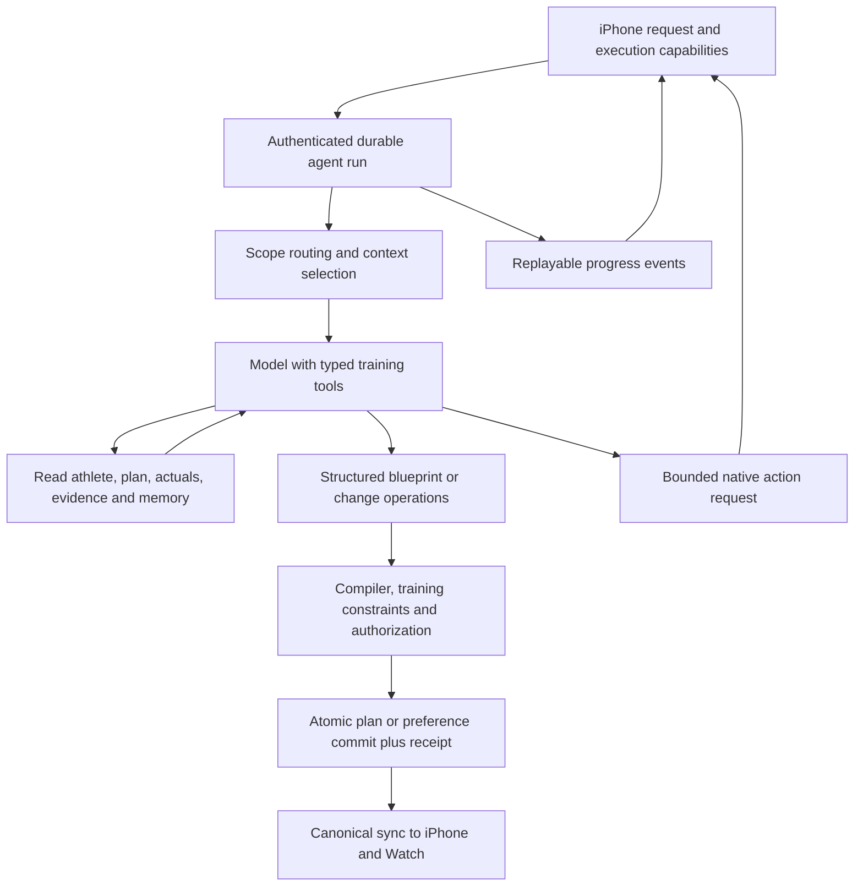

# hybrd AI agent: research and implementation plan

Follow-up: [iOS integration review](ai-ios-integration-review.md) records the native implementation assessment, migration details and remaining contract decisions after reviewing both planning documents.

**Status:** proposed architecture, 25 September 2026. This task adds research and planning documents only. It does not enable cloud AI, deploy services, or change the current API. Repository inspected at `d8e7e39`.

**Product decision:** the new request supersedes the earlier requirement that plan generation remain exclusively on iOS. The backend will orchestrate AI plan creation, analysis and changes. iPhone/Watch will execute workouts, collect measurements and preserve offline operation. Both use one versioned training contract and the same validation fixtures.

## 1. Outcome

The athlete can ask hybrd to create a complete running-and-strength plan, explain an actual workout in detail, change future training, and remember preferences. The response includes usable app activities and a record of what was saved. Clear, reversible instructions can apply immediately; the athlete does not have to approve the same instruction twice.

An agent harness here means a bounded model/tool loop with explicit state, authenticated capabilities, validation, persistence, recovery and measurement. The model decides which allowed training operation helps; application code owns execution. We will expose domain operations, not screen coordinates, arbitrary SQL or remote code execution. This follows the simple composable tool/workflow approach described in [Anthropic's agent engineering guidance](https://www.anthropic.com/engineering/building-effective-agents). The specific design below is our proposal, not a vendor requirement.

## 2. What exists and what must change

| Area | Repository evidence | Required change |
| --- | --- | --- |
| AI gateway | `server/src/intelligence/{routes,service,provider,schemas}.ts`: OpenRouter chat, four Jev decisions, consent, entitlements, quotas, idempotency, validated messages/proposals | Add tool execution, durable runs, contextual reads, plan generation, analysis, memory and real progress events |
| Plan persistence | `server/src/plans/{schemas,service}.ts`: immutable prescriptions, stable logical workout identities, explicit activation, expected active head, preserved completed work | Reuse persistence; add deterministic training validation and a server-authorized action transaction. Current checks are not a complete exercise-science validator |
| Native generator | `ios/Shared/TrainingEngine.swift`: four-week starter generator; `TrainingStore` uses it for plan creation/replanning | Replace cloud creation with agent-generated canonical plans; retain labeled local fallback and native feasibility/execution |
| Native representation | `ios/Shared/TrainingWorkout.swift`, `BackendTrainingMapping.swift`, `BackendTrainingWrites.swift` | Native projection is narrower than the server: distance-only steps, full pace/RPE ranges, rich strength targets and supersets cannot all execute faithfully today |
| Workout detail | `RunRecording.swift`, `WorkoutResult.swift`, server workout schemas | Upload existing laps/actual sets accurately; add optional versioned analysis details and future sensor-series collection. Current recordings do not retain a complete HR time series |
| Catalog | `server/src/catalog/data.ts`: 28 canonical exercises; iOS has a separate bundled catalog | Expand and map catalog IDs, starting with incline bench variants. No invented exercise IDs or name-only matching |
| Native coach | `ios/App/Views/CoachView.swift`, `ios/App/Models/LocalCoach.swift` | Current UI uses local rules. Add connected conversations, run status, citations, action receipts, undo and memory management |
| Science | `server/src/config/policy.ts` contains explicitly labeled development examples | Publish an evidence-backed training policy; the sample 10% running increase and interference-hour settings are not validated product defaults |
| Operations | PostgreSQL, Bun/Hono, Docker Compose, transactional sync, OpenRouter adapter | Add leased run processing and cost/cache telemetry using the existing stack; no new queue/vector service required initially |

See [the independent iOS contract review](ai-ios-harness-review.md) for precise native gaps and test ownership. The original iOS task, **Continue work on official Hybrd repo**, rejected coordination messages with “already has an active writer.” That owner's sign-off remains pending; the independent review is not represented as owner approval.

## 3. Architecture and ownership

The backend owns model/provider selection, policy/evidence versions, canonical facts, run state, tool authorization, validation, mutations and usage accounting. iOS owns permissions, HealthKit reads/writes, live recording, local notifications, navigation and Watch handoff. A device operation can be requested only from a registered supported capability; it executes through the same application service as the visible UI.

Start with one orchestrator and a small tool registry in the current Bun service. Separate deterministic workflows for creation, edits and analysis share the registry. Do not begin with a fleet of specialist model agents. The run worker can initially share the API deployment, using PostgreSQL leases and checkpoints; it can later move to a separate process without changing the protocol. No CPU-heavy analysis runs on the HTTP request path.

## 4. Structured plans that actually execute

### Model output and canonical output

Use two deliberate schemas:

1. **`PlanBlueprintV1`**, model-facing: block objective/horizon, ordered weeks, weekly targets, reusable session templates, dated template instances/overrides, rationale claim IDs, assumptions and missing inputs. Templates contain complete run/strength prescriptions. Compact reuse limits output tokens without leaving future workouts unspecified.
2. **Canonical plan aggregate**, app-facing: the compiler expands the blueprint into every dated workout with catalog UUIDs, physical prescription IDs, stable logical workout IDs, block/context/policy references and versioned execution metadata. Preserve `PlanVersionInput` where possible; add a negotiated prescription schema version for new semantics. The server allocates identities and recomputes totals. The model never chooses account IDs, ownership, acceptance flags or trusted revisions.

Every planned activity must arrive as structured fields consumed by the UI/recorder, not as instructions hidden in Markdown. Evidence and readable explanations accompany the plan as typed artifacts. Generation fails with a useful reason if a requested prescription cannot be represented/executed; never silently turn a distance target into a zero-second interval.

| Running prescription | Resistance prescription |
| --- | --- |
| Date, local timezone, optional start time, workout type, purpose and priority | Date, timezone, session focus, equipment compatibility and exercise order |
| Warm-up/work/recovery/cool-down blocks, ordered steps, repeat counts | Canonical exercise UUIDs, optional superset grouping, permitted alternatives |
| Explicit time/distance/open end condition; defined behavior when multiple targets exist | Warm-up/working/backoff sets; rep ranges; RIR/RPE ranges; optional known load or percentage; rest per set |
| Pace/HR/RPE targets with units and nullable unknown values | Distinguish unknown load from bodyweight/assistance; no invented 1RM |
| Complete duration/distance estimates and instructions | Complete session duration estimate, including work/rest/transitions |

The existing iOS/Watch execution models must be upgraded before activating richer plans. Backend schema support alone is insufficient. Register supported contract versions and capabilities; gate plans to compatible clients and make unsupported plans explicitly read-only or unavailable for execution. Preserve their raw canonical representation rather than rewrite them through a lossy projection. Capability claims are compatibility hints, never security privileges.

Negotiate new sync entity types as well as prescription fields. The current Swift decoder rejects unknown entity variants without advancing its cursor; adding agent artifacts to every client's feed would stall older clients. Keep artifacts on their dedicated read APIs initially, then introduce versioned sync projections or a negotiated feed only after compatibility tests. Do not silently skip records required to reconstruct an executable plan.

### Creation workflow

1. Load the athlete's reviewed onboarding/profile, goals/race date, availability, equipment, exercise rules, recent actual training, current plan and relevant memory. Use server-owned records; the client summary is supplementary data.
2. Snapshot relevant revisions, catalog/policy/evidence versions and current execution capabilities. Ask only for missing facts that materially prevent a feasible plan. Unknown history is not zero training; no HR zones or target loads are invented.
3. Retrieve a small applicable evidence set. Have the model produce the blueprint using schema-constrained output and server-provided exercise references.
4. Compile a complete plan and calculate weekly/session totals deterministically. Validate dates, durations, units, exercise availability, goals, recovery spacing, workload transitions and execution support. Bound total expanded steps/sets across repeated templates before allocating or persisting them; individual array limits do not bound their combined expansion. Do not infer permission for two-a-days from availability on a date.
5. Return structured validation failures to the model for at most one bounded repair. If no valid result exists, report the conflict or offer an explicitly labeled supported fallback; do not quietly clamp the athlete's inputs.
6. Save the complete draft atomically. A **Create and start** action can authorize activation up front; a **Create a plan** request defaults to a reviewable draft. Replacing an existing block requires its scope to be explicit. These modes are product controls, not model-written booleans.
7. Return the canonical plan/artifact IDs and sync sequence. iOS installs it through normal canonical restore and then publishes the supported workout snapshot to Watch.

Schema-constrained generation must still be locally parsed and semantically validated. OpenRouter documents endpoint-specific support and differing enforcement; select tested endpoints with required parameters and reject truncation/refusal/unsupported schemas. [OpenRouter structured outputs](https://openrouter.ai/docs/guides/features/structured-outputs).

### Training validation policy

Implement pure, versioned validators and share golden fixtures across TypeScript and Swift. Cover schedule feasibility, availability overrides, supported baseline range, individual-session and weekly load changes, hard-session density, muscle-group/exercise volume, equipment, session length, recovery priorities, and preserved completed/active prescriptions. Distinguish hard structural constraints from contextual warnings; do not present a heuristic as a physiological certainty. Parameters need an evidence version, applicability conditions and product review. LLM confidence cannot override a hard constraint.

## 5. Science and citations

Create a small curated evidence registry before introducing open-ended research tools. Each `EvidenceClaim` records source ID, DOI/PMID/canonical URL, title/year, study type, population, outcome, supported claim, limitations, applicability tags, review date and evidence version. Store concise original summaries and permitted excerpts, not an unlicensed library of paper text.

The model returns only retrieved claim IDs. The server resolves titles/URLs and verifies the IDs, version and applicability. This establishes source authenticity; separate evaluation/review must test whether the source actually supports the generated recommendation. A valid DOI is not proof of entailment. Plans attach evidence to meaningful decisions—volume, intensity distribution, concurrent scheduling—while marking individualized scheduling choices and preferences as such.

Initial source set researched for this plan:

| Source | Finding relevant to product design | Use and limit |
| --- | --- | --- |
| [ACSM 2026 resistance-training position stand](https://pubmed.ncbi.nlm.nih.gov/41843416/) | Synthesizes resistance-training prescription evidence for strength, hypertrophy, power and physical performance in healthy adults | Build goal-specific resistance policy; do not treat every studied high-load/volume approach as a novice starting prescription |
| [Schumann et al., concurrent training meta-analysis, 2022](https://pmc.ncbi.nlm.nih.gov/articles/PMC8891239/) | Aggregate results distinguish maximal strength/hypertrophy from explosive-strength interference; same-session training matters for the latter | Model priority and scheduling context rather than claiming that running necessarily prevents muscle growth or mandates a universal separation interval |
| [Rosenblat et al., endurance intensity distribution, 2025](https://pubmed.ncbi.nlm.nih.gov/39888556/) | No overall polarized-versus-pyramidal advantage for the reported main outcomes; athlete level may influence response | Choose distributions from level, event and available volume; do not prescribe “80/20” universally. Research three-zone definitions are not automatically the app's five HR zones |
| [Running-session load and injury cohort, 2025](https://pubmed.ncbi.nlm.nih.gov/40623829/) | Observational data associate spikes in a single run relative to recent longest distance with overuse injury | Include individual-session progression checks. This is not proof that a weekly 10% limit guarantees safety, nor an individual injury predictor |

Before activating scientific defaults, complete claim extraction and qualified review of applicability, including beginners, return-to-training and competing goals. Return-to-injury rehabilitation, diagnosis and clinical prescriptions are outside this coach's capabilities. This is a concrete release dependency, not a reason to postpone building the infrastructure.

The UI needs a **Why this plan?** view with citations and applicability explanations, plus inline source links on analyses where scientific interpretation is made. Measured facts cite the athlete's actual result/segment IDs; research claims cite the evidence registry. Clearly distinguish observation, interpretation, uncertainty and recommendation.

## 6. Detailed workout analysis

### Data contract

Add a revision-bound **`WorkoutAnalysisInputV1`** alongside the canonical result:

- Result ID/revision, historical prescription ID, source/recording identity, timestamps/timezone, measurement/algorithm versions, packet checksum and coverage flags.
- Run splits and actual interval boundaries, elapsed/moving/active/pause definitions, distance, measured pace, HR distribution and zone definitions as of the workout, elevation/cadence/power when measured, pause/gap/rejection markers and optional contextual notes.
- Strength exercise and set identities, actual reps/load/load convention/RIR/RPE/status, prescribed-versus-actual comparison, substitutions, and actual rest/set timestamps only when recorded.
- Each measure is `available`, `partial` or `unavailable` with provenance and a reason; null never becomes zero. Historical information absent from both recordings and authorized HealthKit samples stays unavailable.

First upload existing canonical fields that the native app currently omits. Then add bounded time-series windows/buckets and collection of missing signals. Do not send a complete GPS route or second-by-second multi-hour stream in every prompt. iOS can compute quality-aware summaries and, with explicit cloud-data permission, provide bounded additional windows when the agent asks. Precise coordinates remain excluded by default; relative elevation/distance often provides the needed context.

A provisional initial packet limit is 256 KiB, with at most 500 segments and 1,000 downsampled observations per series; validate limits against recorded fixtures before freezing the contract. Larger authorized detail requires paged/chunked retrieval, not raising every request's context budget. The server verifies owner, revision, ordering, units, duration/coverage consistency and checksums. Missing or stale packets lead to a lower-detail answer or a request for refresh.

### Analysis workflow

Read the selected workout, its original prescription and a bounded comparable history. Code computes arithmetic and quality checks: adherence, interval pacing, appropriate HR-zone time, comparable pace/HR drift, set completion, effort trends and explicit substitutions. The model interprets those verified facts and returns `observations[]`, `interpretations[]`, `limitations[]`, `recommendations[]`, `evidenceRefs[]` and optional proposed changes. Each factual item includes result/metric references.

Do not attribute elevated HR to heat, fatigue, dehydration or illness without supporting context; label plausible explanations as hypotheses. Do not compare incompatible terrain/session types or load conventions as if equivalent. Analysis has read-only tools by default and cannot silently rewrite the plan.

Recompute/invalidate analysis when result, prescription association, metrics algorithm or relevant evidence changes. A cached explanation must name the revision it analyzed. Existing Strava approval and source-specific expiry/disconnection behavior carry through; imported data must not become untracked permanent agent memory.

## 7. Direct changes and application capabilities

Build an internal capability registry with JSON input/output schemas, required scopes, allowed execution location, cost class, revision requirements, maximum affected records, undo behavior and audit fields. Give each workflow only its relevant subset. [OpenRouter tool calling](https://openrouter.ai/docs/guides/features/tool-calling) supplies the model/tool protocol; our executor provides authorization and actual effects.

| Capability group | Examples | Execution/authority |
| --- | --- | --- |
| Training reads | `athlete.get`, `plan.get`, `workout.get_details`, `progress.query`, `catalog.search`, `evidence.search`, `memory.search` | Backend ownership-scoped reads; bounded outputs and provenance |
| Plan operations | `plan.create`, `plan.move_workout`, `plan.replace_exercise`, `plan.adjust_targets`, `plan.rebuild_future`, `plan.validate` | Model stages typed operations; server compiles and validates a new version |
| Preferences | `preferences.set_exercise_rule`, `availability.update`, `goals.update` | Explicit requested changes; typed canonical facts, revisions and related plan checks |
| Persistence | `action.commit`, `action.undo` | Executor-controlled transaction using a run-bound authorization grant; model cannot manufacture a grant |
| Tracking | `workout.log_actuals`, `workout.correct_actuals`, `workout.skip` | Only athlete-supplied facts; distinguish “schedule 5 km” from “I ran 5 km.” Corrections preserve provenance/audit and invalidate analysis |
| App navigation | `app.open_workout`, `app.open_plan`, `app.show_analysis` | Native route IDs, not arbitrary URLs or UI scripting |
| Active recording | `recording.start`, `pause`, `resume`, `finish`, `mark_lap`, `rest.start` | Local session owner, foreground/native permission rules and current device state; remote server success is not proof a device recorded anything |
| Memory | `memory.upsert`, `memory.forget`, `memory.search_sessions` | Bounded tenant-scoped records; truth/provenance rules described below |

Start with reads, plans, preferences and analysis. Extend to actual logging and native live commands after their acknowledgement/recovery tests pass. The registry covers the training domain, not unrestricted control over account deletion, purchases, credential changes, Health permissions or third-party publication. Those flows retain their own explicit controls.

### Example: “I would like to always do incline bench press”

1. Resolve the athlete's current bench-family exercises and available incline variants against the canonical catalog. If barbell versus dumbbell remains consequential and unresolved, ask that one question. Do not replace overhead presses or unrelated push movements.
2. Translate “always” into a durable exercise-choice rule for future eligible bench prescriptions, not a free-text note only. Respect explicit exclusions and equipment. Do not copy a flat-bench load onto incline as though equivalent.
3. Materialize the requested substitutions for eligible, not-yet-started workouts in the active block; future generations read the rule. Preserve completed work, logical session identities and the snapshot of any active workout.
4. Validate and atomically commit preference, immutable new plan version, activation, memory reference and audit receipt against captured revisions. The clear current user request supplies authority for this narrow reversible edit. No second “accept proposal” tap is required.
5. Respond from the committed receipt: affected workouts, effective scope, unchanged in-progress/history boundary, and **Undo**. An illustration may say “Updated 4 upcoming sessions”; that count must be computed, not supplied by the model.

The command receipt stores the source user message/request, allowed operations, resolved scope, before/after references and action digest. Server code determines whether the final diff stays inside the authorized scope. Clarify unresolved intent or a change larger than requested. Suggestions from the coach, imported notes and retrieved documents never count as user authorization.

Extend the current coach-origin activation check to accept a verified server action receipt for the new workflow. Retain the accepted-proposal requirement for legacy proposal flows; do not fabricate an accepted proposal or let the model set an acceptance flag. The authorization receipt, affected plan version and active-head update belong to the same transaction.

Before a cloud plan change, the initiating device reconciles its pending outbox and supplies the acknowledged revisions. The current iOS outbox accepts one batch at a time, and hydration prefers optimistic local state while it is pending. Hold the cloud mutation or surface a conflict if that state cannot be reconciled; a server success must not disappear behind an unsent local plan. Server revision checks still protect against other devices' subsequent writes.

The backend cannot know that another device has started a workout while offline. Every recorder therefore pins the immutable prescription at start, keeps its identity through plan replacement, and later syncs actuals against that historical version. New activation must never rewrite an active local session or strand a late result. Reconcile affected future-plan associations explicitly after the result arrives rather than asserting that a server-only active-workout check covers this case.

Undo creates a compensating version; it does not delete history or simply reactivate an obsolete version. Check subsequent edits and newly recorded workouts. Reverse only safe, still-applicable operations, or present the conflict. Include the preference rule in undo so it does not immediately recreate the substitution.

## 8. Guardrails with Jev and deterministic enforcement

Add an internal Jev scope/intent decision with labels such as `hybrid_training`, `app_training_action`, `training_safety`, `mixed`, `out_of_scope`, `needs_clarification`. Feed the current request and just enough conversation to resolve references, not the entire athlete database. Jev's choice probabilities are inputs to a calibrated routing policy, not permission to mutate. [OpenRouter's Jev moderation example](https://openrouter.ai/blog/tutorials/how-to-use-jev/) demonstrates this separation and evaluation against labeled examples.

Out-of-scope requests receive a short training-focused redirection without a general-purpose answer. Mixed requests answer only the relevant portion. Pain/injury concerns receive bounded safety guidance and appropriate referral rather than being treated as unrelated chatter. Guardrail failure or uncertain classification cannot grant mutation access; fall back to a constrained classifier or request clarification. Thresholds come from a multilingual held-out set, not the existing example confidence constants.

Independently enforce auth, tenant ownership, cloud consent, entitlement, tool allowlists, argument schemas, resource limits, source trust, expected revisions and training policy. Treat chat history, memory, research text, workout names/notes and tool results as data. They cannot edit system instructions, select arbitrary URLs/tools, grant permissions or change scope. Filter/validate final responses and tool arguments; never trust a model's claim that it performed an action.

## 9. Memory adapted from Hermes

Hermes maintains small curated user/agent memories, loads a frozen snapshot at session start, and searches older sessions on demand. The frozen prefix helps reuse prompt caches. We should adopt those ideas, not run a desktop filesystem agent inside the app. [Hermes persistent-memory documentation](https://hermes-agent.nousresearch.com/docs/user-guide/features/memory/).

Use PostgreSQL records scoped to the athlete:

| Layer | Contents | Retrieval and lifecycle |
| --- | --- | --- |
| Canonical profile/preferences | Goals, availability, equipment, explicit exercise-choice rules | Source of truth. Memory stores references rather than competing copies |
| Small stable memory | Explicit preferences, communication style, useful confirmed training context | Versioned session snapshot; initial combined budget about 1,200 tokens, tuned through evaluation |
| Episodic memory | Prior decisions, athlete feedback, important conversation excerpts | PostgreSQL full-text search with bounded results. Add embeddings only if retrieval evaluations justify them |
| Training history | Actual results, plans, derived metrics and analyses | Queried by specialized tools rather than pasted into memory |

Each entry has category, source message/result IDs, typed value or short text, explicit/inferred status, confidence, validity interval, revision, sensitivity and supersession/deletion metadata. Explicit corrections supersede old facts. Temporary constraints expire. Do not infer a diagnosis, permanent injury or personality trait from one workout or offhand remark.

Automatic learning means saving useful explicit preferences with a visible receipt and extracting candidate insights from a bounded digest at session boundaries. Inferred insights remain labeled and cannot silently become hard training restrictions. Do not run an expensive “reflect on everything” loop after every message. Learned procedures may be versioned templates evaluated by developers; the agent cannot rewrite its own safety policy or executable tools.

A frozen prompt is an optimization, not stale authority: each run rereads live hard constraints and memory revision. Mid-session changes are returned in tool results and affect the next operation immediately; rebuild the cached snapshot at a natural boundary. Deletion/withdrawal forces a new context and cancels affected pending work even if it costs a cache miss.

Add **What hybrd remembers** with edit, forget, pause learning and clear-memory controls. Deletion removes derived summaries/search indexes, invalidates caches and prevents automatic re-extraction from the same source unless the user supplies it again. Explain that forgetting memory does not itself erase workout history; account export/deletion covers all athlete-owned layers. Forgetting must also prevent a frozen session from continuing to use the removed fact.

## 10. Cost and caching as measurable requirements

Enable prompt caching on every eligible model path. We cannot guarantee a cache hit on every request: first calls, expiry, minimum prefix sizes, provider changes and unsupported APIs create misses. Treat “always” as **always configured and cache-aware**, with measured hit rates. Verify Jev's endpoint independently; do not claim it inherits chat caching. [OpenRouter prompt caching](https://openrouter.ai/docs/guides/best-practices/prompt-caching).

Our proposed prompt order is stable system policy/tool schemas, versioned static evidence/catalog subset, stable athlete-memory snapshot, then changing request/context/tool observations. Keep templates and serialization stable; never put current timestamps or request UUIDs ahead of reusable content. Use an opaque session routing identifier, tested provider-specific cache controls and a consistent provider/model within a session. Keep dynamic hard constraints fresh even when this reduces reuse.

Separate three caches:

- **Provider prompt cache:** reduces inference input work; follow provider-supported TTL/retention behavior. Never pad irrelevant content just to qualify.
- **Application read/analysis cache:** athlete + input revision/hash + model/prompt/policy/evidence/algorithm versions; invalidate on edits or consent changes.
- **Idempotency ledger:** prevents duplicate model charges and repeated writes for the same operation. A cached tool call or explanation never bypasses current authorization or re-executes a mutation.

Avoid global response caching of personalized health responses by default. Keep provider training/logging/retention settings explicit; the current `data_collection: deny` request alone is not a complete retention policy. Cache namespaces and database reads are tenant-isolated. Credentials, raw health data and full prompts stay out of routine logs.

Route by measured task difficulty: Jev for scope/choices, a tested economical tool/structured-output model for routine edits and explanations, and a stronger model only when full-plan quality evaluations justify it. Do not select solely by advertised token price. Pin tested model/provider versions in configuration; rerun evaluations before changing them.

Initial configurable budgets to benchmark, not promised production performance: up to four generative calls per run including one repair, eight read-tool rounds, one atomic mutation batch, and explicit output/context ceilings by workflow. A full block uses compact templates and deterministic expansion; if it must be generated in chunks, all chunks validate before any active-plan change. Stop on budget exhaustion with a durable status, never an unbounded retry loop.

Record uncached input tokens, cached reads, cache writes, output/reasoning tokens where reported, provider cost, model/provider, latency, repair count and cost per successfully completed user task. Preserve “unknown” where a provider omits usage. Compare cold/warm costs and p50/p95 per create/edit/analyze/chat task. Set dollar caps after the initial benchmark with a reviewed price snapshot; no unsupported dollar or hit-rate promise is made here.

## 11. Proposed API and persistence

All following routes are **new proposals**, separate from the existing intelligence contract.

| Endpoint | Purpose |
| --- | --- |
| `POST /v1/agent/runs` | Start a durable `create_plan`, `modify_plan`, `analyze_workout` or `chat` task; return `202` with run/thread IDs |
| `GET /v1/agent/runs/{id}` | Retrieve canonical status, artifacts, error/clarification and committed action receipts |
| `GET /v1/agent/runs/{id}/events` | Authenticated replayable SSE, ordered event IDs and `Last-Event-ID` |
| `POST /v1/agent/runs/{id}/continue` | Supply a typed clarification, explicit authorization or native tool result bound to a server-issued challenge |
| `POST /v1/agent/runs/{id}/cancel` | Request cancellation; report whether a mutation had already committed |
| `POST /v1/agent/actions/{id}/undo` | Perform a validated compensating action |
| `GET /v1/agent/memories` | Inspect paginated user-visible memory and provenance |
| `PATCH`, `DELETE /v1/agent/memories/{id}` | Correct/forget a memory using expected revision; separate clear/pause control in account preferences |
| `PUT /v1/workouts/{resultId}/analysis-input` | Persist a bounded versioned packet tied to an owned result revision, independent of normal result sync |

The `create_plan` task is the plan-generation endpoint through this shared run API; Swift can expose a dedicated `createPlan` method without a second backend execution path. Requests contain an idempotency UUID, task-specific references, message, device ID/capability version and expected input revisions. Reusing a key with different content fails. A new conversation can be created atomically with its first run; canonical threads/messages continue to restore through sync.

Persist `agent_runs`, `agent_steps`, `agent_events`, `agent_actions`, `agent_artifacts`, `athlete_memories`, memory provenance/supersession, exercise-choice rules, evidence documents/claims and workout analysis inputs. Extend existing AI invocation usage rather than creating a second billing ledger. Every athlete-owned table has ownership checks and account-deletion behavior. Artifacts include the full validated plan/analysis/citation schema and version; canonical plans/results remain in their existing tables.

Run states: `queued`, `running`, `awaiting_input`, `awaiting_device`, `succeeded`, `failed`, `cancel_requested`, `cancelled`, `indeterminate`. Leases/fencing prevent duplicate workers; checkpoints surround provider calls and commit. A crash after a provider call has an uncertain billing outcome and cannot be blindly retried. A crash after commit returns the existing receipt. Stop/cancel and consent/account changes are rechecked before every tool effect and final commit.

SSE events include `status`, `tool_status`, `artifact_ready`, `action_committed`, `input_required`, `completed` and sanitized `failed`. Status is an honest short activity label, not chain-of-thought. Heartbeats keep an idle connection alive; durable sequence IDs permit reconnect. Canonical sync remains the source of app state. A stream event never independently advances the sync cursor.

Start with validated artifacts and streamed progress. Add optional prose deltas only under a documented provisional-text contract with scope/output filtering; partial JSON must never become executable workouts. `GET` status plus sync recover after suspension or a dropped stream. Retain a bounded event log (proposed seven days), return an explicit replay-expired response, and keep final run/action receipts independently. Keep `/v1/intelligence/chat`'s existing single-complete-event behavior during migration; do not silently change it.

Native tool challenges have account/device/session scope, action digest, expiry and replay protection. The responding device authenticates normally; an untrusted returned string cannot claim database authorization or historical measurements. If a device is offline/asleep, the run waits or completes with an explicit unavailable capability. No promise of arbitrary background control over Watch.

## 12. Privacy, permissions and retention

Extend the existing cloud-AI consent into a versioned disclosure of data categories and provider purpose, with additional consent for detailed workout signals when needed. HealthKit access is a separate native permission; it does not itself authorize sending data to an AI provider. Apple explicitly requires permission for sharing personal data with third-party AI. [App Review Guidelines §5.1.2(i)](https://developer.apple.com/app-store/review/guidelines/#data-use-and-sharing).

HealthKit does not reveal whether read access was denied; absent samples must remain “unavailable/unknown,” not a claimed diagnosis or definite authorization status. [Apple HealthKit authorization](https://developer.apple.com/documentation/healthkit/hkauthorizationstatus).

Exclude names/email/DOB/precise location from model context unless necessary; normally training age/category, goals and canonical units suffice. Detailed packets may be retained for a short explicit analysis window (initial proposal: 30 days); persistent workout summaries remain canonical under existing account controls. Publish actual retention before enabling collection. Memory opt-out, consent withdrawal and account deletion purge/invalidate derived data and cancel pending runs; delayed responses cannot resurrect it. Keep existing approved Strava use and revocation behavior intact.

## 13. Implementation sequence and acceptance gates

| Phase | Backend work | iOS/Watch work | Exit gate |
| --- | --- | --- | --- |
| 0 — Contract and evidence foundation | Freeze schema/operations, expand canonical catalog incl. incline variants, evidence registry, reviewed policy draft, capability negotiation | Complete executable model mapping; define actual-data coverage, device capabilities and outbox coordination | One rich running and one strength fixture round-trip and execute without semantic loss; old clients keep syncing; original iOS owner reviews the shared contract |
| 1 — Durable read-only agent | Run/step/event persistence, provider adapter with tools/cache usage, Jev scope routing, bounded context reads, consent/entitlement/cost controls | Connected Coach UI, durable request journal, SSE/reconnect/status recovery, citations | Read-only chat across restart/reconnect; no cross-account reads; out-of-scope behavior and cold/warm cost measured |
| 2 — Complete plan generation | Blueprint schema/compiler, constraints, evidence-backed rationales, atomic draft/activation, versioned artifacts | Create/review/start flow, native capability checks, Watch execution | Representative supported goals produce complete executable plans; no unvalidated active plans or fabricated references |
| 3 — Direct edits and memory | Atomic preference/plan action batches, authorization receipts, compensating undo, stable memory and session search | Applied-change/Undo cards, conflict and memory UI | “Always incline bench” survives restart/new plan, applies only intended future workouts, and undo reverses both plan and preference |
| 4 — Detailed analysis | Packet validation/storage, deterministic metrics, targeted retrieval and revision-bound analysis | Sync actual existing detail, add missing collection/query paths and cloud-data disclosure, workout analysis entry point | Analysis distinguishes measured/missing data, cites result facts, handles corrections and matches audited metric fixtures |
| 5 — Broader training tools and release | Actual logging/corrections, bounded native commands, operational alerts and rollout flags | Device action acknowledgements, offline/foreground/Watch lifecycle, all four locales/accessibility | Native hardware acceptance, cost/quality evaluation and staged cohort rollout pass |

Read-only analysis of existing summaries can start in phase 1; phase 4 supplies the requested richer detail. Memory fundamentals and the cache-friendly snapshot format begin in phase 1, with automatic learning/edit UI released in phase 3. Each phase builds on the same run/tool framework.

Backend module candidates: `server/src/agent/{routes,runner,tools,authorization,events,schemas}.ts`, `server/src/plans/{compiler,validation}.ts`, `server/src/evidence/`, `server/src/memory/`, `server/src/workouts/analysis/`. iOS integration should use application services behind `BackendAppController`, `TrainingStore` and the native recorder rather than writing directly from the chat view. Regenerate OpenAPI/Swift wire types and maintain shared fixture files under `contracts/fixtures/ai/`.

Keep the dev environment on Docker Compose with API and PostgreSQL. Add a worker service only when operationally necessary; initially the run processor shares the API process with a clear shutdown/lease boundary. Test providers remain injected. Before live model evaluation, configure OpenRouter/model routes, a valid test entitlement and consenting test accounts. The current local `.env` lacks the OpenRouter key and chat-model selection. Use synthetic fixtures first, not private workout uploads for provider benchmarking.

## 14. Tests and rollout criteria

- **Plan property/fixture tests:** valid dates/timezones/DST, time/distance/open steps, nested repeats and bounded expansion, ranges/units, equipment/catalog identity, no arbitrary load assumptions, complete horizon, realistic duration accounting, impossible availability, missing history, policy boundaries and immutable completed work. TypeScript → Swift → Watch parity uses identical fixtures; old clients continue syncing across additive contract changes.
- **Mutation tests:** precise scope for explicit requests, ambiguous bench variants, no unrelated substitutions, one-time versus persistent preference, atomic plan+memory commit, legacy proposal versus new action authorization, duplicate/replayed tool calls, stale head/profile revisions, pending offline outbox, concurrent devices, offline-started sessions syncing after replacement, newly completed sessions, safe undo and interrupted native recordings.
- **Analysis tests:** metric arithmetic, recorded-versus-prescribed separation, overlap-safe lap/interval accounting, gaps/pauses/HR coverage, historical zones, mixed load conventions, corrected/deleted results and invalidation. Adversarial prompts cannot fabricate missing traces or elevate a hypothesis into an observation.
- **Agent/security tests:** tenant isolation, consent/entitlement loss mid-run, account deletion, malicious workout notes/retrieved text/memory, out-of-scope and mixed tasks, unsupported tools, argument tampering, device-result forgery, stale approvals, budget exhaustion, crashes around provider/commit, cancellation races and SSE replay.
- **Memory tests:** explicit correction precedence, temporary expiry, source deletion, forgetting during an active cached session, no re-extraction from suppressed sources, no sensitive speculative traits, and environment/account isolation after sign-out.
- **Evidence evaluations:** every displayed citation resolves to the curated claim/version; expert review checks recommendation support and population applicability. Include unsupported/fabricated citation attempts and uncertainty cases.
- **Model evaluations:** a versioned synthetic case set across endurance/resistance priorities, experience, equipment, limited time, unusual requests and English/Spanish/Portuguese/French. Compare task success, semantic validity, repair rates, refusal false positives/negatives, citation support, latency and cost. Use held-out cases and human-reviewed labels rather than model self-grading alone.
- **Cache evaluations:** repeated stable sessions show reported cache reads where supported; cold calls/expiry/fallback are accounted for, stale memory/policy changes invalidate correctly, and no mutation is replayed from a response cache.

Release must have zero unauthorized/cross-account mutations and zero invalid committed plans in the acceptance suite. Other numerical quality/latency/cost thresholds are set from the first benchmark before cohort rollout, not invented as current guarantees. A qualified reviewer approves the evidence/policy set. Native real-device tests verify recording, HealthKit, Watch transport and suspension; server tests cannot establish those behaviors.

Roll out flags separately for agent reads, generation, direct edits, memory and detailed analysis. Shadow generation against reviewed synthetic cases before enabling writes; begin with internal users, then a small consenting cohort. Rollback disables new agent operations while preserving existing plans, results, receipts and manual/offline use. Model/provider changes require the same regression evaluation.

## 15. Decisions carried forward and remaining sign-off

Proceed with OpenRouter through the existing backend, Jev as a candidate scope router, PostgreSQL-backed runs/memory, typed domain tools, server plan generation with native execution, and direct explicit reversible edits plus undo. Use source-backed evidence cards and measured cache behavior rather than relying on citations from model memory or assuming universal cache hits.

Before implementation contracts freeze, the iOS owner needs to review executable prescriptions, detailed-data coverage, active recording protection and native tool acknowledgements in the companion review. Product/science review must approve supported athlete populations, training policy and initial plan horizons. Model/provider choice and dollar budgets follow the synthetic benchmark. These are bounded design decisions; no production changes are implied by this plan.
