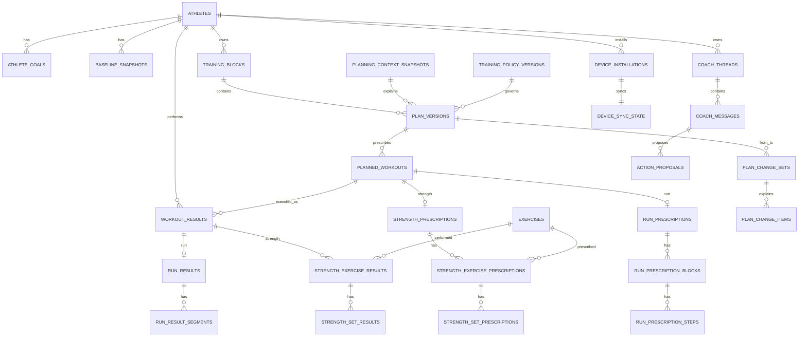

# hybrd — Technical Architecture & Stack

**Document type:** Technical architecture / implementation design  
**Version:** 0.1  
**Date:** 21 September 2026  
**Product:** hybrd  
**Status:** Proposed MVP architecture  
**Product requirements source:** `hybrd_mvp_product_design_requirements.md` v0.1

---

## 1. Purpose

This document defines the initial technical architecture for **hybrd**, an iOS-first training operating system for athletes who intentionally combine running and resistance training.

The product requirements establish an important boundary: hybrd is not just a workout logger. It must coordinate running and strength, preserve planned-versus-actual training, import historical activity, generate and adapt multi-week plans, repair plans after real-life disruptions, surface useful progress, and provide an athlete-grounded AI coach.

The architecture is therefore optimized for five goals:

1. **Keep infrastructure extremely simple and inexpensive.**
2. **Use the iPhone as a real compute node rather than a thin UI client.**
3. **Keep PostgreSQL as the durable canonical record without storing unnecessary raw sensor data.**
4. **Escalate from deterministic code to AI only when the problem actually requires it.**
5. **Preserve enough history and auditability to explain how and why training changed.**

The resulting design is a **local-first iOS application synchronized to a small Railway control plane**.

---

# 2. Architectural decision summary

## 2.1 Final high-level architecture

```text
                         HealthKit / Apple Watch
                                  |
                                  v
+------------------------------------------------------------------+
|                              iPhone                              |
|                                                                  |
| Swift + SwiftUI                                                  |
| SwiftData                                                        |
| HealthKit / WorkoutKit / StoreKit 2                              |
|                                                                  |
| Local Training Engine                                            |
| - ingestion + normalization                                      |
| - workout execution                                              |
| - analytics + trends                                             |
| - plan candidate generation                                      |
| - deterministic progression                                      |
| - schedule validation                                            |
| - feature extraction for remote intelligence                     |
|                                                                  |
| Local Intelligence                                               |
| - Apple Foundation Models when available                         |
| - Core ML / Core AI later where useful                           |
|                                                                  |
| Local sync outbox + local canonical projection                   |
+-------------------------------+----------------------------------+
                                |
                   compact records, events,
                 decisions, and hard questions
                                |
                                v
+------------------------------------------------------------------+
|                             Railway                              |
|                                                                  |
| Bun + TypeScript + Hono                                          |
| Better Auth                                                      |
| Drizzle                                                          |
|                                                                  |
| Responsibilities                                                 |
| - authentication                                                 |
| - canonical persistence                                          |
| - sync + conflict resolution                                     |
| - remote configuration / training policy                         |
| - entitlements                                                   |
| - push notification gateway                                      |
| - OpenRouter credential + quota gateway                          |
| - Jev decision gateway                                           |
| - generative LLM gateway                                         |
|                                                                  |
| PostgreSQL                                                       |
|                                                                  |
+-------------------------------+----------------------------------+
                                |
                                v
                         OpenRouter
                    /                     \
             Jev decision model       Generative LLMs
```

## 2.2 Core principle

> **Compute locally when the answer can be derived safely and deterministically from data already on the device. Persist remotely when the information is part of the athlete's durable training record. Escalate to remote intelligence only when judgment or generative reasoning materially improves the result.**

The iPhone is therefore not merely a frontend. It is the primary **local data-processing and workout-compute node**.

Railway is the **control plane and durable account system**.

---

# 3. Technology stack

## 3.1 iOS application

| Concern | Technology | Decision |
|---|---|---|
| Language | **Swift** | Native-only iOS MVP; no cross-platform abstraction needed. |
| UI | **SwiftUI** | Primary application UI framework. |
| Local persistence | **SwiftData** | Local training projection, offline workout data, cached plans, sync outbox, cached policy. |
| Concurrency | **Swift Concurrency** | `async/await`, actors, structured concurrency. |
| Networking | **URLSession** | Used underneath generated API client. |
| API client generation | **Swift OpenAPI Generator** | Generate type-safe Swift DTO/client code from the backend OpenAPI contract. |
| Health data | **HealthKit** | Read supported training history and newly recorded activity. |
| Workout delivery | **WorkoutKit** | Send supported structured workouts to Apple workout surfaces/watch. |
| Purchases | **StoreKit 2** | Native subscription / entitlement purchase flow. |
| Local generative intelligence | **Apple Foundation Models** | Optional local intelligence tier where device capability allows it. |
| Future local predictive models | **Core ML / Core AI** | Deferred until a concrete predictive workload exists. |

## 3.2 Backend application

| Concern | Technology | Decision |
|---|---|---|
| Language | **TypeScript** | Main backend language. |
| Runtime/tooling | **Bun** | Runtime, package management, scripts, tests where practical. |
| HTTP framework | **Hono** | Small API surface and low framework overhead. |
| Validation | **Zod** | Runtime validation and shared server-side types. |
| API schema | **OpenAPI 3.1** | Contract-first boundary between TypeScript backend and Swift client. |
| OpenAPI integration | **Hono + Zod OpenAPI** | Request/response schemas generate the OpenAPI document. |
| Database access | **Drizzle ORM** | SQL-oriented PostgreSQL access and migrations. |
| Authentication | **Better Auth** | Sign in with Apple initially; room for later providers without replacing auth. |
| AI gateway | **OpenRouter** | One model provider surface for Jev and generative LLMs. |
| Structured decision model | **Jev (`~typesafe/jev-latest`)** | Bounded classification, ranking, routing, scoring, and fuzzy decisions. |
| Generative models | **OpenRouter-configured LLMs** | Used only for open-ended reasoning/explanation/conversation. |

## 3.3 Infrastructure

| Concern | Technology | Decision |
|---|---|---|
| Application hosting | **Railway** | Single infrastructure provider for MVP. |
| Database | **Railway PostgreSQL** | Canonical durable database. |
| Object storage | **Railway Bucket — deferred** | Do not provision until the application has a real blob/file use case. |
| Background worker | **Deferred** | No dedicated worker for MVP unless a concrete asynchronous server workload appears. |
| Queue | **Deferred** | If needed later, prefer a PostgreSQL-backed queue before adding Redis. |
| Redis | **Not used** | No MVP requirement justifies it. |
| Kubernetes | **Not used** | Unnecessary operational complexity. |
| External cloud services | **Avoided** | Railway remains the infrastructure provider; OpenRouter is an application dependency, not infrastructure hosting. |

## 3.4 MVP Railway topology

```text
Railway Project: hybrd

+----------------------+      private Railway network      +--------------------+
| hybrd-api            | --------------------------------> | PostgreSQL         |
| Bun / Hono           |                                   | canonical data     |
+----------+-----------+                                   +--------------------+
           |
           | HTTPS
           v
      OpenRouter
```

This is intentionally only **two Railway services** at launch:

1. `hybrd-api`
2. `postgres`

A worker or bucket is added only when an actual feature creates the requirement.

---

# 4. Repository structure

A monorepo is preferred for the MVP.

```text
hybrd/
|
+-- ios/
|   +-- App/
|   +-- Features/
|   |   +-- Onboarding/
|   |   +-- Calendar/
|   |   +-- Running/
|   |   +-- Strength/
|   |   +-- Dashboard/
|   |   +-- Coach/
|   +-- Domain/
|   +-- Persistence/
|   +-- HealthKit/
|   +-- WorkoutKit/
|   +-- TrainingEngine/
|   |   +-- Metrics/
|   |   +-- Planning/
|   |   +-- Progression/
|   |   +-- Scheduling/
|   |   +-- Validation/
|   +-- Intelligence/
|   |   +-- Local/
|   |   +-- Remote/
|   +-- Sync/
|   +-- GeneratedAPI/
|
+-- server/
|   +-- src/
|   |   +-- api/
|   |   +-- auth/
|   |   +-- sync/
|   |   +-- athlete/
|   |   +-- plans/
|   |   +-- workouts/
|   |   +-- intelligence/
|   |   |   +-- jev/
|   |   |   +-- llm/
|   |   +-- config/
|   |   +-- billing/
|   |   +-- notifications/
|   |   +-- db/
|   |   +-- telemetry/
|   +-- migrations/
|   +-- openapi/
|
+-- contracts/
|   +-- openapi.yaml
|
+-- docs/
```

### API contract workflow

```text
Zod schemas + Hono routes
          |
          v
   OpenAPI 3.1 document
          |
          +---------------------+
          |                     |
          v                     v
Backend validation        Swift OpenAPI Generator
                                |
                                v
                       generated iOS API client
```

The iOS application should not maintain a second hand-written set of network DTOs when the API can generate them.

---

# 5. Responsibility boundary: iOS vs backend

## 5.1 iOS owns

The device owns operations that are:

- based primarily on data already on the device;
- deterministic;
- latency-sensitive;
- useful offline;
- inexpensive to recompute;
- or privacy-improving when kept local.

### iOS responsibilities

- active strength workout execution;
- rest timers;
- manual run/strength entry;
- HealthKit queries and change observation;
- raw HealthKit sample processing;
- activity normalization before sync;
- basic imported-workout matching;
- run split calculation;
- HR-zone summaries;
- running volume calculations;
- long-run progression;
- pace/HR trend calculations;
- strength volume and hard-set calculations;
- e1RM and PR calculations;
- adherence calculation;
- dashboard projections;
- deterministic progression rules;
- schedule proximity checks;
- hard scheduling constraints;
- generation of feasible plan/replan candidates;
- construction of compact feature vectors for Jev/LLMs;
- local coach answers where no cloud reasoning is required;
- local Foundation Models use when supported;
- local notification scheduling for predictable workout reminders;
- offline persistence;
- sync outbox and retry logic.

## 5.2 Backend owns

The backend owns operations that require:

- durable account-level truth;
- credentials or secrets;
- synchronization between installations;
- billing verification;
- guaranteed server execution;
- centralized policy/configuration;
- cloud AI access;
- or cross-device conflict arbitration.

### Backend responsibilities

- account/authentication state;
- canonical durable training record;
- canonical plan/version history;
- accepted coach action proposals;
- synchronization cursor/change log;
- conflict detection/resolution;
- StoreKit transaction verification and entitlements;
- device registration for remote push notifications;
- training-policy distribution;
- OpenRouter credentials;
- model routing and quotas;
- Jev requests;
- generative LLM requests;
- AI usage/cost auditing;
- server-triggered push notifications;
- future server-side third-party OAuth integrations.

## 5.3 Responsibility matrix

| Capability | iOS | Railway |
|---|:---:|:---:|
| Active workout | Primary | Persist after sync |
| Rest timer | Yes | No |
| HealthKit access | Yes | No |
| Raw sensor processing | Yes | No by default |
| Workout normalization | Yes | Validate canonical form |
| Dashboard analytics | Yes | No |
| e1RM / strength trends | Yes | No |
| Running trends | Yes | No |
| Plan candidate generation | Yes | No |
| Hard schedule validation | Yes | Policy source |
| Fuzzy candidate ranking | Prepare state | Jev |
| Simple progression | Yes | No |
| Fuzzy progression judgment | Prepare state | Jev |
| Simple coach facts | Yes | No |
| Local generative explanation | Optional | Fallback only |
| Complex coach reasoning | Prepare context | LLM |
| Durable account backup | Local replica | Canonical |
| Auth secrets | No | Yes |
| OpenRouter key | Never | Yes |
| Billing entitlement | Display/cache | Canonical |
| Push gateway | Receive | Send |
| Training-policy definition | Execute/cache | Publish/version |

---

# 6. Intelligence architecture

The system uses four escalating computational tiers.

```text
Tier 0
Deterministic Swift
$0 marginal inference cost
        |
        | unresolved / fuzzy
        v
Tier 1
On-device Foundation Models / Core ML
$0 marginal server inference cost
        |
        | unavailable or insufficient
        v
Tier 2
Jev via OpenRouter
very low-cost bounded decisions
        |
        | open-ended reasoning/generation required
        v
Tier 3
Generative LLM via OpenRouter
highest-cost tier
```

## 6.1 Tier 0 — deterministic code

Use ordinary code for anything directly computable:

- volume;
- duration;
- pace;
- HR distributions;
- e1RM;
- session proximity;
- progression thresholds;
- calendar constraints;
- candidate generation;
- exact plan differences;
- adherence;
- trend inputs.

## 6.2 Tier 1 — on-device intelligence

Use Apple Foundation Models only as an optional acceleration/cost-saving layer for tasks such as:

- summarizing locally computed training data;
- classifying simple coach questions;
- extracting structured intent;
- explaining deterministic metrics in natural language;
- creating short local summaries.

It must **never be a mandatory runtime dependency** because device availability/capability can differ.

## 6.3 Tier 2 — Jev

Jev is used for bounded judgments, not prose.

Representative tasks:

- `HOLD / REDUCE / INCREASE` progression choice;
- selecting the best feasible weekly schedule candidate;
- interference severity classification;
- workout execution quality;
- anomaly classification;
- required-context selection for a coach question;
- model-tier routing;
- verification of whether an LLM explanation is supported by supplied state.

The iPhone should send **compact features**, not raw history.

Example:

```json
{
  "completionRate": 0.94,
  "weeklyDistanceKm": 48.2,
  "previousWeeklyDistanceKm": 45.0,
  "keyRunCompletionRate": 0.91,
  "easyRunRpeTrend": 0.02,
  "missedSessionsLast14d": 1,
  "strengthPerformanceTrend": -0.03,
  "raceWeeksRemaining": 11
}
```

instead of uploading thousands of raw measurements.

## 6.4 Tier 3 — generative LLMs

Use LLMs for:

- open-ended coaching conversation;
- complex explanations;
- novel situations not represented by a bounded decision schema;
- trade-off discussions;
- natural-language responses requiring synthesis across multiple training dimensions.

The LLM does **not** directly mutate canonical training state.

When it proposes an action, it returns a structured `action_proposal`. The iPhone validates it locally, shows the user the consequences, and only materializes a new plan after explicit acceptance where required.

---

# 7. Data ownership and data-classification rules

## 7.1 Canonical data

Canonical data is data that must survive:

- application deletion;
- phone replacement;
- new device installation;
- future web/iPad clients;
- plan revisions;
- long-term account history.

Canonical data belongs in PostgreSQL.

Examples:

- athlete profile and goals;
- accepted training plans;
- workout prescriptions;
- completed workout summaries;
- set-by-set strength results;
- meaningful run segments;
- plan changes;
- coach conversations/actions if the product chooses to persist them;
- subscription entitlement;
- AI decisions that materially changed training.

## 7.2 Derived data

Derived data is inexpensive to recompute and should normally remain local.

Examples:

- weekly mileage charts;
- e1RM trends;
- adherence percentages;
- cached dashboard cards;
- rolling pace-at-HR estimates;
- feature vectors supplied to Jev;
- candidate schedule scores.

Derived data is not automatically copied to PostgreSQL.

## 7.3 Raw sensor data

Raw second-by-second data remains in HealthKit by default.

Do **not** upload by default:

- second-by-second heart rate;
- raw GPS points;
- accelerometer streams;
- raw cadence streams;
- continuous power traces.

The iPhone reduces these into decision-useful summaries and segments before synchronization.

If a future feature genuinely requires raw time-series data, introduce Railway object storage deliberately rather than expanding PostgreSQL into a sensor warehouse.

---

# 8. Database design principles

## 8.1 PostgreSQL conventions

- Primary keys: **UUID**, generated client-side where offline creation is required.
- Timestamps representing instants: `timestamptz` in UTC.
- Athlete-facing training dates: explicit `date` column.
- Time zone at activity: store the relevant IANA time-zone identifier.
- Distances: integer meters.
- Durations: integer seconds or milliseconds when required.
- Strength load: canonical kilograms using `numeric` precision; UI converts to/from pounds.
- RPE/RIR: `numeric(3,1)` to permit half-step values if supported by UX.
- Soft deletion for synchronized mutable entities: `deleted_at`.
- Synchronized mutable entities carry a monotonically increasing `revision`.
- Logical enums should generally be text + validation/check constraints to keep migrations flexible.
- JSONB is appropriate for **snapshots, provider metadata, AI outputs, and evolving derived structures**; it should not replace relational modeling for core workout data.

## 8.2 Planned vs actual is physically separated

A completed workout never overwrites the prescription.

```text
plan_version
     |
     v
planned_workout ---------> exact prescription
     |
     | performed against
     v
workout_result ----------> actual athlete execution
```

If the plan later changes, the result still points to the exact prescription it was performed against.

## 8.3 Plans are versioned immutably

A plan revision creates a new `plan_versions` row and a new set of planned workout rows.

Unchanged workouts retain the same `logical_workout_id` across plan versions.

```text
Plan v4                         Plan v5
-----------------              -----------------
logical A -> workout A4   ---> logical A -> workout A5
logical B -> workout B4   ---> logical B -> workout B5 (moved)
logical C -> workout C4        removed
                               logical D -> workout D5 (added)
```

This gives the application:

- deterministic diffing;
- explainable replanning;
- historical reconstruction;
- safe coach proposals;
- simple rollback/reference behavior.

---

# 9. PostgreSQL data model

The tables below describe the intended logical model. Exact indexes and constraints should be added in migrations as implementation begins.

---

## 9.1 Authentication tables — Better Auth managed

Better Auth owns its generated authentication schema, including user/session/provider-account records.

Application code should treat the Better Auth user identifier as an external authentication identity and avoid coupling domain logic to Better Auth's internal columns.

### `athletes`

One domain athlete per authenticated user for MVP.

| Column | Type | Notes |
|---|---|---|
| `id` | uuid PK | Domain athlete ID. |
| `auth_user_id` | text UNIQUE | Better Auth user identity. |
| `timezone` | text | Current IANA time zone. |
| `locale` | text | Presentation locale. |
| `distance_unit` | text | `km` or `mi`. |
| `load_unit` | text | `kg` or `lb`. |
| `week_starts_on` | smallint | User/calendar convention. |
| `training_day_boundary` | time nullable | Optional local boundary for assigning late-night workouts to a training day. |
| `created_at` | timestamptz | |
| `updated_at` | timestamptz | |
| `revision` | bigint | Sync revision. |
| `deleted_at` | timestamptz nullable | Account/domain soft deletion state. |

---

## 9.2 Athlete goals and planning inputs

### `athlete_training_preferences`

Current editable training intent that does not need a new account when it changes.

| Column | Type | Notes |
|---|---|---|
| `athlete_id` | uuid PK/FK | |
| `priority_mode` | text | `balanced`, `run_first`, `strength_first`, `custom`. |
| `run_priority_weight` | numeric(4,3) | 0-1 normalized weight. |
| `strength_priority_weight` | numeric(4,3) | 0-1 normalized weight. |
| `strength_objective` | text | `strength`, `hypertrophy`, `maintenance`, `mixed`. |
| `experience_level` | text nullable | Product-level experience classification. |
| `notes` | text nullable | General non-medical training context. |
| `updated_at` | timestamptz | |
| `revision` | bigint | |

### `athlete_goals`

Supports multiple simultaneous goals while retaining old goals rather than rewriting them.

| Column | Type | Notes |
|---|---|---|
| `id` | uuid PK | |
| `athlete_id` | uuid FK | |
| `discipline` | text | `running`, `strength`, `hybrid`. |
| `goal_type` | text | e.g. `marathon`, `10k`, `bench`, `hypertrophy`, `maintenance`. |
| `status` | text | `active`, `completed`, `paused`, `cancelled`. |
| `target_date` | date nullable | Race/event date where applicable. |
| `target_value` | numeric nullable | Generic numeric target. |
| `target_unit` | text nullable | `seconds`, `kg`, etc. |
| `priority_rank` | smallint nullable | Ordering inside same discipline. |
| `metadata` | jsonb | Sport-specific details without proliferating sparse columns. |
| `created_at` | timestamptz | |
| `updated_at` | timestamptz | |
| `revision` | bigint | |
| `deleted_at` | timestamptz nullable | |

Examples of `metadata`:

```json
{
  "raceDistanceM": 42195,
  "targetFinishSeconds": 14400
}
```

or:

```json
{
  "exerciseId": "...",
  "targetLoadKg": 140,
  "targetReps": 1
}
```

### `athlete_availability_rules`

Recurring availability.

| Column | Type | Notes |
|---|---|---|
| `id` | uuid PK | |
| `athlete_id` | uuid FK | |
| `day_of_week` | smallint | 1-7. |
| `available` | boolean | |
| `max_sessions` | smallint | Usually 0, 1, or 2. |
| `min_session_minutes` | smallint nullable | |
| `max_session_minutes` | smallint nullable | |
| `preference` | text | `preferred`, `neutral`, `avoid`. |
| `revision` | bigint | |

### `athlete_availability_overrides`

Date-specific exceptions such as travel or a blocked day.

| Column | Type | Notes |
|---|---|---|
| `id` | uuid PK | |
| `athlete_id` | uuid FK | |
| `date` | date | |
| `available` | boolean | |
| `max_sessions` | smallint nullable | |
| `max_session_minutes` | smallint nullable | |
| `reason` | text nullable | User-facing context. |
| `revision` | bigint | |

### `baseline_snapshots`

Stores the athlete-visible baseline reconstructed locally from recent history and optionally corrected by the athlete.

| Column | Type | Notes |
|---|---|---|
| `id` | uuid PK | |
| `athlete_id` | uuid FK | |
| `period_start` | date | |
| `period_end` | date | |
| `schema_version` | integer | Version of baseline feature schema. |
| `metrics` | jsonb | Recent run/strength baseline summary. |
| `confidence` | jsonb | Confidence/missing-data metadata. |
| `source` | text | `healthkit`, `manual`, `mixed`. |
| `confirmed_at` | timestamptz nullable | Athlete accepted baseline. |
| `created_at` | timestamptz | |

The baseline is a **derived snapshot with user significance**, so storing it is useful even though the raw calculations happen locally.

### `planning_context_snapshots`

Immutable input snapshot used to produce a specific plan version.

| Column | Type | Notes |
|---|---|---|
| `id` | uuid PK | |
| `athlete_id` | uuid FK | |
| `baseline_snapshot_id` | uuid nullable FK | |
| `schema_version` | integer | |
| `policy_version_id` | uuid FK | Policy under which context was interpreted. |
| `snapshot` | jsonb | Goals, priority, availability, recent features, constraints. |
| `checksum` | text | Reproducibility/deduplication. |
| `created_at` | timestamptz | Immutable. |

This table solves an important historical problem: a user's goals can change later without changing the inputs that explain why an older plan looked the way it did.

---

## 9.3 Exercise and equipment catalog

### `exercises`

| Column | Type | Notes |
|---|---|---|
| `id` | uuid PK | |
| `slug` | text UNIQUE | Stable machine-readable key. |
| `name` | text | Display name. |
| `movement_pattern` | text nullable | squat, hinge, horizontal_push, etc. |
| `unilateral` | boolean | |
| `active` | boolean | Allows catalog retirement without deleting history. |
| `metadata` | jsonb | Optional future catalog data. |

### `exercise_aliases`

Maps alternate/provider names to a canonical exercise.

| Column | Type | Notes |
|---|---|---|
| `id` | uuid PK | |
| `exercise_id` | uuid FK | |
| `source` | text | `user`, provider name, migration source. |
| `alias` | text | |

### `muscle_groups`

| Column | Type | Notes |
|---|---|---|
| `id` | uuid PK | |
| `slug` | text UNIQUE | |
| `name` | text | |

### `exercise_muscles`

| Column | Type | Notes |
|---|---|---|
| `exercise_id` | uuid FK | Composite PK. |
| `muscle_group_id` | uuid FK | Composite PK. |
| `role` | text | `primary`, `secondary`, `stabilizer`. |

Avoid pretending exact fractional muscle stress is known. The MVP only needs enough structure to support useful hard-set grouping.

### `equipment`

| Column | Type | Notes |
|---|---|---|
| `id` | uuid PK | |
| `slug` | text UNIQUE | |
| `name` | text | |

### `exercise_equipment`

| Column | Type | Notes |
|---|---|---|
| `exercise_id` | uuid FK | Composite PK. |
| `equipment_id` | uuid FK | Composite PK. |
| `required` | boolean | Required vs optional setup. |

### `athlete_equipment`

| Column | Type | Notes |
|---|---|---|
| `athlete_id` | uuid FK | Composite PK. |
| `equipment_id` | uuid FK | Composite PK. |
| `available` | boolean | |
| `revision` | bigint | |

### `athlete_exercise_preferences`

| Column | Type | Notes |
|---|---|---|
| `athlete_id` | uuid FK | Composite PK. |
| `exercise_id` | uuid FK | Composite PK. |
| `preference` | text | `preferred`, `neutral`, `avoid`, `exclude`. |
| `notes` | text nullable | |
| `revision` | bigint | |

---

## 9.4 Training blocks and plan versioning

### `training_blocks`

Stable container for a multi-week training block.

| Column | Type | Notes |
|---|---|---|
| `id` | uuid PK | |
| `athlete_id` | uuid FK | |
| `name` | text | User-facing block name. |
| `start_date` | date | |
| `end_date` | date | |
| `phase` | text | `build`, `maintain`, `deload`, `taper`, etc. |
| `status` | text | `draft`, `active`, `completed`, `cancelled`. |
| `active_plan_version_id` | uuid nullable FK | Current accepted plan head. |
| `created_at` | timestamptz | |
| `updated_at` | timestamptz | |
| `revision` | bigint | |

### `plan_versions`

Immutable version of the plan inside a block.

| Column | Type | Notes |
|---|---|---|
| `id` | uuid PK | |
| `training_block_id` | uuid FK | |
| `athlete_id` | uuid FK | Denormalized for fast authorization/filtering. |
| `version_number` | integer | Unique within block. |
| `base_plan_version_id` | uuid nullable FK | Version from which this one was derived. |
| `planning_context_snapshot_id` | uuid FK | Exact planning inputs. |
| `policy_version_id` | uuid FK | Exact policy/rule set. |
| `origin` | text | `initial`, `manual_edit`, `adaptive`, `replan`, `coach`. |
| `status` | text | `draft`, `active`, `superseded`, `rejected`. |
| `summary` | text nullable | Human-readable summary. |
| `created_at` | timestamptz | |
| `activated_at` | timestamptz nullable | |

**Rule:** plan-version content is immutable after activation.

### `planned_workouts`

A plan-version-specific prescription envelope.

| Column | Type | Notes |
|---|---|---|
| `id` | uuid PK | Exact prescribed workout instance. |
| `plan_version_id` | uuid FK | |
| `logical_workout_id` | uuid | Stable identity across versions. |
| `discipline` | text | `running`, `strength`. |
| `workout_type` | text | e.g. `easy`, `threshold`, `long`, `upper`, `lower`. |
| `scheduled_date` | date | Athlete training date. |
| `scheduled_start_at` | timestamptz nullable | Only when exact time matters. |
| `timezone` | text | IANA zone used for scheduling. |
| `title` | text | |
| `purpose` | text nullable | Why the session exists. |
| `priority` | text | `key`, `supporting`, `optional`. |
| `estimated_duration_s` | integer nullable | |
| `planned_distance_m` | integer nullable | Convenience summary. |
| `instructions` | text nullable | Athlete-readable instructions. |
| `created_at` | timestamptz | Immutable with the plan version. |

Recommended indexes:

- `(plan_version_id, scheduled_date)`
- `(logical_workout_id)`
- `(athlete via plan_version, scheduled_date)` via query path/index strategy

---

## 9.5 Running prescription model

### `run_prescriptions`

One-to-one extension of `planned_workouts`.

| Column | Type | Notes |
|---|---|---|
| `planned_workout_id` | uuid PK/FK | |
| `primary_target_type` | text nullable | `pace`, `heart_rate`, `rpe`, `mixed`, `open`. |
| `notes` | text nullable | |

### `run_prescription_blocks`

Supports continuous work and repeat groups without needing arbitrary nested JSON.

| Column | Type | Notes |
|---|---|---|
| `id` | uuid PK | |
| `planned_workout_id` | uuid FK | |
| `sequence` | integer | |
| `repeat_count` | integer | `1` for ordinary sequential block. |
| `label` | text nullable | e.g. `Main set`. |

Example interval session:

```text
Block 1 x1: warm-up 2 km
Block 2 x5: work 1 km + recovery 2 min
Block 3 x1: cooldown 2 km
```

### `run_prescription_steps`

| Column | Type | Notes |
|---|---|---|
| `id` | uuid PK | |
| `block_id` | uuid FK | |
| `sequence` | integer | |
| `step_kind` | text | `warmup`, `work`, `recovery`, `cooldown`, `steady`, `stride`. |
| `distance_m` | integer nullable | Distance-controlled step. |
| `duration_s` | integer nullable | Time-controlled step. |
| `pace_min_s_per_km` | numeric nullable | Faster/lower bound handling defined in domain code. |
| `pace_max_s_per_km` | numeric nullable | |
| `hr_min_bpm` | smallint nullable | |
| `hr_max_bpm` | smallint nullable | |
| `rpe_min` | numeric(3,1) nullable | |
| `rpe_max` | numeric(3,1) nullable | |
| `notes` | text nullable | |

The schema intentionally permits more than one target field because some sessions may provide a primary target plus a secondary guardrail.

---

## 9.6 Strength prescription model

### `strength_prescriptions`

| Column | Type | Notes |
|---|---|---|
| `planned_workout_id` | uuid PK/FK | |
| `session_focus` | text nullable | `upper`, `lower`, `full_body`, etc. |
| `notes` | text nullable | |

### `strength_exercise_prescriptions`

| Column | Type | Notes |
|---|---|---|
| `id` | uuid PK | |
| `planned_workout_id` | uuid FK | |
| `exercise_id` | uuid FK | Intended movement. |
| `sequence` | integer | Exercise order. |
| `superset_group_id` | uuid nullable | Exercises sharing the same value are grouped. |
| `substitution_allowed` | boolean | |
| `notes` | text nullable | |

### `strength_set_prescriptions`

Set-level prescription is explicit because different warm-up and working sets may have different targets.

| Column | Type | Notes |
|---|---|---|
| `id` | uuid PK | |
| `exercise_prescription_id` | uuid FK | |
| `set_number` | smallint | |
| `set_kind` | text | `warmup`, `working`, `backoff`, etc. |
| `reps_min` | smallint nullable | |
| `reps_max` | smallint nullable | |
| `load_kg` | numeric(8,3) nullable | Exact prescribed load when known. |
| `load_percent_e1rm` | numeric(5,2) nullable | Optional relative load prescription. |
| `rpe_min` | numeric(3,1) nullable | |
| `rpe_max` | numeric(3,1) nullable | |
| `rir_min` | numeric(3,1) nullable | |
| `rir_max` | numeric(3,1) nullable | |
| `rest_s` | integer nullable | |
| `notes` | text nullable | |

### `strength_substitution_options`

| Column | Type | Notes |
|---|---|---|
| `exercise_prescription_id` | uuid FK | Composite key component. |
| `substitute_exercise_id` | uuid FK | Composite key component. |
| `priority` | smallint | Preferred order. |
| `rationale` | text nullable | |

---

## 9.7 Completed workout model

### `workout_results`

Common execution envelope for running and strength.

| Column | Type | Notes |
|---|---|---|
| `id` | uuid PK | Client-generated offline-safe ID. |
| `athlete_id` | uuid FK | |
| `planned_workout_id` | uuid nullable FK | Exact prescription performed against. |
| `logical_workout_id` | uuid nullable | Allows relationship to future/previous plan versions. |
| `discipline` | text | `running`, `strength`. |
| `training_date` | date | Explicit athlete-relevant date. |
| `timezone` | text | Zone at execution. |
| `started_at` | timestamptz nullable | Nullable for skipped/unavailable outcomes. |
| `ended_at` | timestamptz nullable | |
| `completion_status` | text | `completed`, `partial`, `modified`, `abandoned`, `skipped`. |
| `source_type` | text | `manual`, `healthkit`, future provider. |
| `session_rpe` | numeric(3,1) nullable | |
| `notes` | text nullable | |
| `created_at` | timestamptz | |
| `updated_at` | timestamptz | |
| `revision` | bigint | Sync concurrency. |
| `deleted_at` | timestamptz nullable | |

A skipped session may be represented by a `workout_results` row with `completion_status = skipped` and no performance rows. This preserves the fact that the athlete intentionally marked the session rather than merely never touching it.

---

## 9.8 Running results

### `run_results`

One-to-one extension of a running `workout_results` row.

| Column | Type | Notes |
|---|---|---|
| `workout_result_id` | uuid PK/FK | |
| `distance_m` | integer | |
| `duration_s` | integer | |
| `moving_duration_s` | integer nullable | |
| `avg_hr_bpm` | smallint nullable | |
| `max_hr_bpm` | smallint nullable | |
| `elevation_gain_m` | numeric nullable | |
| `avg_cadence_spm` | numeric nullable | |
| `hr_zone_summary` | jsonb nullable | Zone boundaries + duration, not raw HR samples. |
| `source_summary` | jsonb nullable | Small provider-specific summary fields only. |

Pace is normally derived from distance and duration rather than stored redundantly.

### `run_result_segments`

Stores meaningful splits/workout segments, not every sensor sample.

| Column | Type | Notes |
|---|---|---|
| `id` | uuid PK | |
| `workout_result_id` | uuid FK | |
| `prescription_step_id` | uuid nullable FK | Exact planned step when matched. |
| `segment_type` | text | `split`, `warmup`, `work`, `recovery`, `cooldown`, etc. |
| `sequence` | integer | |
| `repeat_iteration` | integer nullable | For repeated interval blocks. |
| `distance_m` | integer nullable | |
| `duration_s` | integer | |
| `avg_hr_bpm` | smallint nullable | |
| `max_hr_bpm` | smallint nullable | |
| `elevation_gain_m` | numeric nullable | |
| `avg_cadence_spm` | numeric nullable | |
| `start_offset_s` | integer nullable | Relative position inside workout. |

---

## 9.9 Strength results

### `strength_exercise_results`

| Column | Type | Notes |
|---|---|---|
| `id` | uuid PK | |
| `workout_result_id` | uuid FK | |
| `prescribed_exercise_id` | uuid nullable FK | Intended exercise prescription. |
| `exercise_id` | uuid FK | Exercise actually performed. |
| `sequence` | integer | Actual order. |
| `notes` | text nullable | |
| `substitution_reason` | text nullable | |

The intended and performed exercises are separate so substitutions preserve plan intent.

### `strength_set_results`

| Column | Type | Notes |
|---|---|---|
| `id` | uuid PK | |
| `exercise_result_id` | uuid FK | |
| `prescribed_set_id` | uuid nullable FK | Planned set if one exists. |
| `set_number` | smallint | |
| `set_kind` | text | `warmup`, `working`, etc. |
| `reps` | smallint nullable | |
| `load_kg` | numeric(8,3) nullable | |
| `rpe` | numeric(3,1) nullable | |
| `rir` | numeric(3,1) nullable | |
| `status` | text | `completed`, `failed`, `skipped`. |
| `completed_at` | timestamptz nullable | |

PRs, volume, e1RM, and trends are calculated locally from these durable facts.

---

## 9.10 External activity provenance and matching

### `activity_source_records`

Tracks provenance and deduplication without copying provider raw payloads into the core schema.

| Column | Type | Notes |
|---|---|---|
| `id` | uuid PK | |
| `athlete_id` | uuid FK | |
| `provider` | text | `healthkit`, future `strava`, `garmin`, etc. |
| `external_id` | text nullable | Provider identifier when available. |
| `fingerprint` | text | Local canonical fingerprint for duplicate detection. |
| `workout_result_id` | uuid nullable FK | Canonical normalized result. |
| `source_created_at` | timestamptz nullable | |
| `source_updated_at` | timestamptz nullable | |
| `source_deleted_at` | timestamptz nullable | |
| `import_status` | text | `imported`, `partial`, `deleted`, `error`. |
| `match_status` | text | `unmatched`, `suggested`, `confirmed`, `rejected`. |
| `match_confidence` | numeric(5,4) nullable | Confidence when matching is heuristic. |
| `matched_logical_workout_id` | uuid nullable | Intended session identity. |
| `metadata` | jsonb | Minimal source metadata. |
| `created_at` | timestamptz | |
| `updated_at` | timestamptz | |
| `revision` | bigint | |

Recommended uniqueness:

- unique `(athlete_id, provider, external_id)` when `external_id` is non-null;
- indexed `(athlete_id, fingerprint)`.

Future OAuth-based providers may add a separate `source_connections` table. It is not required for a HealthKit-first MVP because HealthKit authorization lives on-device.

---

## 9.11 Plan change and audit model

### `plan_change_sets`

Semantic reason linking one accepted plan version to another.

| Column | Type | Notes |
|---|---|---|
| `id` | uuid PK | |
| `athlete_id` | uuid FK | |
| `from_plan_version_id` | uuid nullable FK | Null for initial plan. |
| `to_plan_version_id` | uuid FK | |
| `origin` | text | `manual`, `adaptive`, `replan`, `coach`. |
| `reason_code` | text nullable | Machine-friendly reason. |
| `explanation` | text nullable | Athlete-readable reason. |
| `material` | boolean | Whether user confirmation was required. |
| `proposal_id` | uuid nullable FK | Coach proposal that caused change. |
| `created_at` | timestamptz | |

### `plan_change_items`

| Column | Type | Notes |
|---|---|---|
| `id` | uuid PK | |
| `change_set_id` | uuid FK | |
| `logical_workout_id` | uuid | |
| `change_type` | text | `added`, `removed`, `moved`, `prescription_changed`. |
| `before_planned_workout_id` | uuid nullable FK | |
| `after_planned_workout_id` | uuid nullable FK | |
| `changes` | jsonb | Compact field-level diff for inspection. |

This is an audit table, not the source of truth for the plan itself.

---

## 9.12 Remote intelligence and coach data

### `intelligence_context_snapshots`

Persist only when a cloud decision is important enough to require reproducibility/audit.

| Column | Type | Notes |
|---|---|---|
| `id` | uuid PK | |
| `athlete_id` | uuid FK | |
| `context_type` | text | `progression`, `replan`, `coach`, etc. |
| `schema_version` | integer | Feature-vector schema version. |
| `window_start` | timestamptz nullable | Data window represented. |
| `window_end` | timestamptz nullable | |
| `features` | jsonb | Compact, derived state. |
| `checksum` | text | |
| `retention_class` | text | Allows short retention for low-value routing calls. |
| `created_at` | timestamptz | |

### `ai_invocations`

Operational/cost record for cloud AI calls.

| Column | Type | Notes |
|---|---|---|
| `id` | uuid PK | |
| `athlete_id` | uuid nullable FK | Null for non-user/system tests. |
| `kind` | text | `jev`, `llm`. |
| `provider` | text | `openrouter`. |
| `model` | text | Exact model identifier used. |
| `feature` | text | `progression`, `coach`, `router`, etc. |
| `prompt_version` | text nullable | Version controlled prompt/decision schema. |
| `context_snapshot_id` | uuid nullable FK | |
| `request_hash` | text nullable | Dedup/debug without storing full prompt. |
| `input_tokens` | integer nullable | |
| `output_tokens` | integer nullable | |
| `cost_usd_micros` | bigint nullable | Cost tracking without floating currency math. |
| `latency_ms` | integer nullable | |
| `status` | text | `success`, `error`, `timeout`. |
| `provider_request_id` | text nullable | |
| `created_at` | timestamptz | |

**Privacy rule:** raw prompts are not stored by default merely for observability. Store the minimum required for product behavior and debugging.

### `structured_decisions`

Jev/structured-model result that materially matters to the product.

| Column | Type | Notes |
|---|---|---|
| `id` | uuid PK | |
| `invocation_id` | uuid FK | |
| `decision_type` | text | e.g. `running_load_action`. |
| `selected_choice` | text | |
| `confidence` | numeric(6,5) nullable | |
| `alternatives` | jsonb nullable | Other probabilities/scores when returned. |
| `result` | jsonb | Full typed decision payload. |
| `created_at` | timestamptz | |

### `coach_threads`

| Column | Type | Notes |
|---|---|---|
| `id` | uuid PK | |
| `athlete_id` | uuid FK | |
| `title` | text nullable | |
| `created_at` | timestamptz | |
| `updated_at` | timestamptz | |
| `deleted_at` | timestamptz nullable | |
| `revision` | bigint | |

### `coach_messages`

| Column | Type | Notes |
|---|---|---|
| `id` | uuid PK | |
| `thread_id` | uuid FK | |
| `role` | text | `user`, `assistant`, `system_event`. |
| `content` | text | Final user-visible content. |
| `ai_invocation_id` | uuid nullable FK | Assistant cloud call if applicable. |
| `created_at` | timestamptz | |
| `revision` | bigint | |
| `deleted_at` | timestamptz nullable | |

### `action_proposals`

Structured proposed mutations generated by the coach.

| Column | Type | Notes |
|---|---|---|
| `id` | uuid PK | |
| `athlete_id` | uuid FK | |
| `thread_id` | uuid nullable FK | |
| `message_id` | uuid nullable FK | |
| `base_plan_version_id` | uuid nullable FK | Proposal validity anchor. |
| `action_type` | text | `move_workout`, `replan_week`, `modify_prescription`, etc. |
| `action_payload` | jsonb | Typed proposal details. |
| `rationale` | text nullable | |
| `status` | text | `pending`, `accepted`, `rejected`, `expired`, `applied`. |
| `expires_at` | timestamptz nullable | |
| `accepted_at` | timestamptz nullable | |
| `applied_plan_version_id` | uuid nullable FK | Result after iOS validates/materializes change. |
| `created_at` | timestamptz | |

The backend never interprets `accepted` as permission to arbitrarily rewrite the plan. The iOS training engine materializes the new validated plan version and syncs it.

---

## 9.13 Training-policy configuration

### `training_policy_versions`

Versioned remote configuration executed by the local training engine.

| Column | Type | Notes |
|---|---|---|
| `id` | uuid PK | |
| `version` | integer UNIQUE | Monotonic public policy number. |
| `schema_version` | integer | Config structure version. |
| `status` | text | `draft`, `published`, `retired`. |
| `config` | jsonb | Thresholds, limits, routing rules, feature flags. |
| `checksum` | text | ETag/content identity. |
| `minimum_app_version` | text nullable | Optional compatibility guard. |
| `published_at` | timestamptz nullable | |
| `created_at` | timestamptz | |

Example:

```json
{
  "interference": {
    "lowerBeforeKeyRun": {
      "warningHours": 36,
      "severeHours": 18
    }
  },
  "running": {
    "defaultProgression": {
      "maxWeeklyIncrease": 0.10
    }
  },
  "intelligence": {
    "jevConfidence": {
      "auto": 0.90,
      "review": 0.70
    }
  }
}
```

The architecture deliberately separates:

> **local computation** from **remotely tunable policy**.

---

## 9.14 Device, StoreKit, and entitlement data

### `device_installations`

| Column | Type | Notes |
|---|---|---|
| `id` | uuid PK | Generated by installation. |
| `athlete_id` | uuid FK | |
| `platform` | text | `ios`. |
| `app_version` | text | |
| `os_version` | text nullable | |
| `push_token` | text nullable | APNs token. |
| `push_enabled` | boolean | |
| `created_at` | timestamptz | |
| `last_seen_at` | timestamptz | |
| `revoked_at` | timestamptz nullable | |

### `storekit_transactions`

| Column | Type | Notes |
|---|---|---|
| `transaction_id` | text PK | Apple transaction identity. |
| `athlete_id` | uuid FK | |
| `original_transaction_id` | text nullable | Subscription lineage. |
| `product_id` | text | |
| `environment` | text | sandbox/production. |
| `purchased_at` | timestamptz | |
| `expires_at` | timestamptz nullable | |
| `revoked_at` | timestamptz nullable | |
| `verified_payload` | jsonb | Minimal verified claims required for audit. |
| `created_at` | timestamptz | |

### `entitlements`

| Column | Type | Notes |
|---|---|---|
| `athlete_id` | uuid FK | Composite PK. |
| `entitlement_key` | text | Composite PK, e.g. `pro`. |
| `status` | text | `active`, `grace`, `expired`, `revoked`. |
| `valid_until` | timestamptz nullable | |
| `source` | text | `app_store`, future admin/promo source. |
| `revision` | bigint | |
| `updated_at` | timestamptz | |

---

## 9.15 Synchronization tables

Local-first architecture only remains simple if synchronization is deliberately modeled.

### `sync_mutations`

Idempotency ledger for client writes.

| Column | Type | Notes |
|---|---|---|
| `client_mutation_id` | uuid PK | Generated once by iOS. |
| `athlete_id` | uuid FK | |
| `device_id` | uuid FK | |
| `entity_type` | text | |
| `entity_id` | uuid | |
| `operation` | text | `create`, `update`, `delete`, `activate_plan`. |
| `received_at` | timestamptz | |
| `status` | text | `applied`, `conflict`, `rejected`. |
| `result` | jsonb nullable | Small deterministic response for retry replay. |

Repeated submission of the same mutation returns the same effective outcome.

### `sync_change_log`

Append-only server change feed.

| Column | Type | Notes |
|---|---|---|
| `sequence` | bigint identity PK | Global monotonic cursor. |
| `athlete_id` | uuid FK | |
| `entity_type` | text | |
| `entity_id` | uuid | |
| `operation` | text | `upsert`, `delete`. |
| `row_revision` | bigint nullable | |
| `changed_at` | timestamptz | |

The API can return the changed entity payload with each change, avoiding N+1 fetches.

### `device_sync_state`

| Column | Type | Notes |
|---|---|---|
| `device_id` | uuid PK/FK | |
| `athlete_id` | uuid FK | |
| `last_pulled_sequence` | bigint | |
| `last_push_at` | timestamptz nullable | |
| `updated_at` | timestamptz | |

This is also useful later when deciding how long deletion tombstones must be retained.

---

# 10. Simplified relationship diagram



---

# 11. SwiftData local model

The local database is **not a blind copy of PostgreSQL**. It contains:

1. a local projection of canonical data;
2. local-only processing state;
3. ephemeral/derived caches.

## 11.1 Canonical projections cached locally

Persist local representations of:

- athlete/profile;
- goals/preferences/availability;
- current and relevant prior plan versions;
- planned workouts and prescriptions;
- workout results;
- run segments;
- strength sets;
- exercise catalog needed by the athlete;
- coach threads/messages if enabled;
- entitlement;
- current training policy.

The UI should read from this local store first rather than make synchronous server queries for ordinary navigation.

## 11.2 Local-only models

### `LocalHealthKitImportState`

Stores HealthKit query anchors/cursors and the last successful import time.

Never sync this to PostgreSQL.

### `LocalHealthKitWorkoutFingerprint`

Tracks locally processed source identities/fingerprints before/while canonical sync completes.

### `LocalAnalyticsCache`

Materialized projections for fast UI:

- weekly mileage series;
- adherence cards;
- e1RM series;
- hard-set summaries;
- pace-at-HR trend;
- current block summary.

These can always be deleted and rebuilt.

### `LocalFeatureSnapshot`

Short-lived compact features prepared for Jev/LLM calls.

Only a material remote decision may cause the feature snapshot to be persisted server-side as an `intelligence_context_snapshot`.

### `SyncOutboxMutation`

| Field | Purpose |
|---|---|
| `id` | Stable `client_mutation_id`. |
| `entity_type` | Server entity category. |
| `entity_id` | Domain ID. |
| `operation` | create/update/delete/activate plan. |
| `base_revision` | Server revision iOS believed it was editing. |
| `payload` | Encodable mutation body. |
| `created_at` | Ordering/debug. |
| `attempt_count` | Retry policy. |
| `next_retry_at` | Backoff. |
| `state` | pending/sending/conflict/acked. |

### `LocalSyncCursor`

Stores the last `sync_change_log.sequence` successfully applied.

### `LocalPolicyCache`

Stores the published training-policy version and checksum so most app launches do not download configuration again.

## 11.3 Raw HealthKit samples

Raw samples should normally be processed in memory and discarded after producing:

- canonical workout summary;
- meaningful run segments;
- local analytics.

They should not become permanent SwiftData entities unless a concrete feature requires persistent local raw traces.

---

# 12. Synchronization design

## 12.1 Sync goals

The sync protocol must support:

- offline strength workouts;
- client-created UUIDs;
- safe retry after network failure;
- more than one device eventually;
- server canonical persistence;
- plan-version concurrency;
- deletions;
- efficient incremental pulls.

## 12.2 Push model

Every local canonical mutation is committed locally first, then appended to the outbox.

```text
User logs set
     |
     v
SwiftData transaction
  - update set
  - add outbox mutation
     |
     v
UI confirms immediately
     |
     v
background sync
     |
     v
POST /v1/sync/push
```

The mutation includes:

- `client_mutation_id`;
- `entity_type`;
- `entity_id`;
- `operation`;
- `base_revision` where applicable;
- payload.

The backend processes each mutation idempotently.

## 12.3 Pull model

The server exposes a monotonically increasing change cursor.

```text
GET /v1/sync/pull?cursor=4832
```

returns all relevant changes after sequence `4832` plus the new cursor.

## 12.4 Conflict behavior

### Normal editable entity

If:

```text
client base revision = 8
server revision       = 8
```

apply and produce revision `9`.

If:

```text
client base revision = 8
server revision       = 10
```

the server returns a conflict instead of silently overwriting newer state.

The iOS client pulls the current record, performs an entity-specific merge or asks the user only when required, and retries with a new mutation ID.

### Plan activation

Plan head activation uses compare-and-swap semantics:

```text
activate plan v7
only if current active plan == v6
```

If another device/action already changed the active plan, return:

```text
PLAN_HEAD_CONFLICT
```

and require local re-evaluation/rebase.

### Append-like workout results

Offline-created set/result IDs are client-generated UUIDs, so independent new sets can generally merge without collision.

## 12.5 Deletion

Synced entities use soft deletion initially.

Deletion produces a change-log tombstone so another installation can remove the record locally.

Physical purge can happen later after an appropriate retention window and once active devices are beyond the deletion sequence.

---

# 13. API design

The API is intentionally small because ordinary app reads and analytics come from SwiftData.

Base path:

```text
/v1
```

Authentication endpoints are provided by Better Auth under their configured route prefix.

## 13.1 API design principles

- JSON over HTTPS.
- OpenAPI 3.1 is the source of truth for public request/response contracts.
- Zod validates every untrusted request.
- Swift client is generated from OpenAPI.
- All write endpoints support an idempotency strategy.
- Domain writes normally enter through sync rather than dozens of CRUD endpoints.
- Remote AI endpoints never accept arbitrary model IDs from untrusted clients; server policy selects allowed models.
- Remote AI endpoints never expose provider keys.
- Material plan mutations happen through canonical sync after local validation.

## 13.2 Error envelope

```json
{
  "error": {
    "code": "REVISION_CONFLICT",
    "message": "The record changed on another device.",
    "details": {
      "entityType": "athlete_goal",
      "entityId": "...",
      "serverRevision": 10
    },
    "requestId": "..."
  }
}
```

Stable error codes matter more than stable human-readable messages.

---

## 13.3 Bootstrap

### `GET /v1/bootstrap`

Returns the small amount of server state needed immediately after authentication.

Response:

```json
{
  "athlete": {
    "id": "...",
    "timezone": "America/Monterrey"
  },
  "device": {
    "registered": true
  },
  "sync": {
    "latestSequence": 8124
  },
  "policy": {
    "version": 17,
    "checksum": "sha256:..."
  },
  "entitlements": [
    {
      "key": "pro",
      "status": "active",
      "validUntil": null
    }
  ]
}
```

For a new installation, the app then pulls canonical records from cursor `0` or uses a future snapshot optimization if account history becomes very large.

---

## 13.4 Push sync

### `POST /v1/sync/push`

Request:

```json
{
  "deviceId": "0a...",
  "mutations": [
    {
      "id": "82...",
      "entityType": "strength_set_result",
      "entityId": "31...",
      "operation": "create",
      "baseRevision": null,
      "payload": {
        "exerciseResultId": "...",
        "setNumber": 3,
        "setKind": "working",
        "reps": 6,
        "loadKg": 100,
        "rir": 2
      }
    }
  ]
}
```

Response:

```json
{
  "results": [
    {
      "mutationId": "82...",
      "status": "applied",
      "entityRevision": 1
    }
  ],
  "serverSequence": 8125
}
```

A batch may contain mixed successes/conflicts; one bad mutation should not necessarily force replay of the entire batch.

---

## 13.5 Pull sync

### `GET /v1/sync/pull?cursor=8125&limit=500`

Response:

```json
{
  "changes": [
    {
      "sequence": 8126,
      "entityType": "plan_version",
      "entityId": "...",
      "operation": "upsert",
      "revision": null,
      "payload": {
        "id": "...",
        "versionNumber": 7,
        "status": "active"
      }
    }
  ],
  "nextCursor": 8126,
  "hasMore": false
}
```

Changes should include payloads for ordinary records so the client does not need to perform one request per changed ID.

---

## 13.6 Training-policy configuration

### `GET /v1/config/training-policy`

Supports `ETag` / `If-None-Match`.

Response:

```json
{
  "version": 17,
  "schemaVersion": 3,
  "checksum": "sha256:...",
  "config": {
    "interference": {},
    "progression": {},
    "intelligence": {}
  }
}
```

The client continues using its last compatible cached policy if temporarily offline.

---

## 13.7 Structured decision endpoint

### `POST /v1/intelligence/decision`

This is the remote Jev primitive.

The client cannot send arbitrary prompts. It sends one of the server-supported decision types with a versioned state schema.

Request:

```json
{
  "decisionType": "next_week_running_load",
  "schemaVersion": 2,
  "context": {
    "completionRate": 0.94,
    "weeklyDistanceKm": 48.2,
    "previousWeeklyDistanceKm": 45.0,
    "keyRunCompletionRate": 0.91,
    "easyRunRpeTrend": 0.02,
    "missedSessionsLast14d": 1,
    "strengthPerformanceTrend": -0.03,
    "raceWeeksRemaining": 11
  },
  "choices": [
    "reduce_significantly",
    "reduce_slightly",
    "hold",
    "increase_slightly",
    "increase_moderately"
  ]
}
```

Response:

```json
{
  "decision": "increase_slightly",
  "confidence": 0.91,
  "alternatives": [
    { "choice": "hold", "confidence": 0.07 },
    { "choice": "increase_moderately", "confidence": 0.02 }
  ],
  "decisionId": "...",
  "policyVersion": 17
}
```

Backend responsibilities for this endpoint:

1. authenticate user;
2. validate schema/decision type;
3. enforce entitlement/rate limit;
4. choose allowed Jev model alias;
5. call OpenRouter;
6. validate typed result;
7. log usage/material decision according to retention policy;
8. return normalized output.

---

## 13.8 Coach endpoint

### `POST /v1/intelligence/chat`

Use streaming response (SSE) where supported by generated/client networking implementation.

Request:

```json
{
  "threadId": "...",
  "message": "Can I move my lower session to Friday?",
  "context": {
    "schemaVersion": 4,
    "activePlanVersionId": "...",
    "relevantWorkouts": [],
    "recentFeatures": {},
    "athletePriority": {
      "running": 0.7,
      "strength": 0.3
    }
  }
}
```

The iPhone constructs a **minimal relevant context package**. It does not upload the entire athlete history on every message.

Final event may contain:

```json
{
  "type": "complete",
  "messageId": "...",
  "content": "...",
  "actionProposals": [
    {
      "id": "...",
      "type": "move_workout",
      "basePlanVersionId": "...",
      "payload": {
        "logicalWorkoutId": "...",
        "targetDate": "2026-09-25"
      }
    }
  ]
}
```

The iOS application then:

1. runs its local scheduling/validation engine;
2. displays relevant conflicts/trade-offs;
3. obtains confirmation if material;
4. creates the new plan version locally;
5. syncs it.

The LLM itself never receives database credentials and never directly executes SQL mutations.

---

## 13.9 Device registration

### `PUT /v1/devices/{deviceId}`

Used for installation metadata and APNs token.

```json
{
  "appVersion": "0.1.0",
  "osVersion": "27.0",
  "pushToken": "...",
  "pushEnabled": true
}
```

### `DELETE /v1/devices/{deviceId}`

Revokes the installation/push registration.

Workout reminders that can be derived from the local calendar should use **local notifications** rather than requiring server scheduling.

---

## 13.10 StoreKit / entitlement sync

### `POST /v1/billing/apple/transactions`

The application submits the signed StoreKit transaction representation needed for server verification.

Response returns canonical entitlement.

### `GET /v1/billing/entitlements`

Small fallback endpoint; current entitlement is also returned by bootstrap/sync.

---

## 13.11 Account operations

### `DELETE /v1/account`

Initiates account deletion according to the final product retention policy.

### Future: `GET /v1/account/export`

Not required for the first internal build, but the relational model should make a useful export possible later.

---

# 14. Important application workflows

## 14.1 First onboarding + historical baseline

```text
Sign in with Apple
        |
        v
Create/bootstrap athlete account
        |
        v
Request HealthKit permission
        |
        v
Read recent supported workout history locally
        |
        v
Local normalization + baseline calculations
        |
        v
User reviews/corrects inferred baseline
        |
        v
Sync normalized workout history + baseline snapshot
        |
        v
Local plan engine creates feasible candidates
        |
        +--> deterministic ranking may resolve choice
        |
        +--> ambiguous choice -> Jev
        |
        v
User reviews plan
        |
        v
Create plan v1 locally + sync canonical copy
```

No raw HealthKit time series needs to pass through Railway.

---

## 14.2 Active strength workout

```text
Open workout from SwiftData
        |
        v
Log sets locally
        |
        +--> rest timer local
        +--> previous performance local
        +--> e1RM/volume local
        |
        v
Finish workout
        |
        v
Local deterministic evaluation
        |
        +--> obvious progression -> local recommendation
        |
        +--> fuzzy progression -> compact state -> Jev
        |
        v
Outbox syncs workout result + accepted future-plan changes
```

Internet loss must not break the workout.

---

## 14.3 Imported run

```text
HealthKit observer notices new workout
        |
        v
Read workout + raw samples locally as required
        |
        v
Build summary / zones / meaningful segments
        |
        v
Match against planned workouts locally
        |
        +--> high confidence -> match
        |
        +--> ambiguous -> ask athlete / remote decision only if useful
        |
        v
Create canonical normalized workout_result locally
        |
        v
Sync result + provenance reference
```

---

## 14.4 Move a workout

```text
User drags Thursday threshold -> Friday
        |
        v
Local hard-constraint + interference rules
        |
        +--> no material issue -> create new plan version immediately
        |
        +--> material ambiguity -> generate local alternatives
                                  |
                                  v
                                 Jev
                                  |
                                  v
                           suggested candidate
        |
        v
User accepts if material
        |
        v
New immutable plan version + change set
        |
        v
Sync
```

---

## 14.5 Coach question

```text
User question
     |
     v
Local intent / deterministic resolver
     |
     +--> factual/local answer possible -> answer locally
     |
     +--> on-device Foundation Model sufficient -> local response
     |
     +--> bounded fuzzy decision -> Jev
     |
     +--> open-ended reasoning -> compact context -> LLM
                                      |
                                      v
                              optional Jev verifier
                                      |
                                      v
                                   response
```

This hierarchy is the main LLM-cost-control mechanism.

---

# 15. Background execution strategy

The iPhone may perform opportunistic background work, but the architecture must not assume iOS is an always-on server.

Suitable device background work:

- process HealthKit changes;
- refresh local analytics;
- retry sync;
- refresh policy;
- schedule local notifications.

Do not rely on iOS for:

- exact-time globally guaranteed jobs;
- continuous polling;
- operations that must happen even when the app/device has been inactive for a long period.

If a future feature creates that requirement, add a Railway worker/cron at that time.

---

# 16. Backend modular-monolith structure

There should be one backend deployment, with internal modules rather than microservices.

```text
server/src/

api/
auth/
athlete/
sync/
plans/
workouts/
config/
billing/
notifications/

intelligence/
  jev/
    decision-registry.ts
    progression.ts
    schedule-ranking.ts
    context-routing.ts
    verification.ts

  llm/
    model-router.ts
    coach.ts
    explainer.ts

telemetry/
db/
```

The backend does not need a separate `running-service`, `strength-service`, `ai-service`, or `analytics-service`.

---

# 17. Security and privacy decisions

## 17.1 Secrets

Never place the following in the iOS application:

- OpenRouter API key;
- Apple server-side private keys;
- database credentials;
- server signing secrets.

## 17.2 Health data minimization

Only normalized, product-relevant summaries are synchronized by default.

The server does not need raw GPS or second-level HR traces to provide the MVP product.

## 17.3 Authorization

Every domain query must be scoped by authenticated athlete ownership.

Do not rely only on IDs being unguessable.

## 17.4 AI privacy

Before sending cloud AI context:

- derive a minimal feature/context package locally;
- omit irrelevant history;
- do not include raw health streams;
- avoid storing raw prompts purely for telemetry;
- preserve enough structured decision history to explain material plan changes.

## 17.5 Coach mutation safety

AI output is advice/proposal, not authority.

Material actions become canonical only through the same validated plan/version workflow as user edits.

---

# 18. Cost-control decisions

The architecture deliberately attacks cost at the design level rather than after launch.

## 18.1 Backend-compute savings

- dashboard calculations run locally;
- raw HealthKit processing runs locally;
- baseline reconstruction runs locally;
- simple workout matching runs locally;
- plan candidate generation runs locally;
- deterministic progression runs locally;
- local notifications replace many scheduled backend jobs.

## 18.2 Database savings

- no raw second-by-second workout samples;
- no redundant analytics materialization in PostgreSQL by default;
- meaningful segments instead of sensor streams;
- immutable plan versions are small relative to raw sensor data and provide high audit value.

## 18.3 AI savings

Order of preference:

1. deterministic Swift;
2. on-device model;
3. Jev;
4. cheap generative model;
5. stronger reasoning model.

Jev should receive compact features rather than complete workout histories.

The conventional LLM should receive only context selected for the current question.

## 18.4 Current Jev assumption

At the time of this document, OpenRouter exposes `~typesafe/jev-latest`, currently pointing to Jev 1.13. OpenRouter lists a 32K context window and pricing of approximately **$0.042 per million input tokens with free output**. Treat those values as operational assumptions, not hard-coded product behavior; pricing/model versions can change.

---

# 19. Scaling path

## Stage 1 — personal/internal use

```text
Railway API
Railway PostgreSQL
OpenRouter
```

## Stage 2 — early users

Same architecture.

Optimize indexes, connection pooling, sync batching, and AI context before adding infrastructure.

## Stage 3 — real asynchronous server workload appears

Add:

```text
Railway API
Railway worker
Railway PostgreSQL
```

A PostgreSQL-backed queue is preferred before introducing Redis unless workload characteristics demonstrate otherwise.

## Stage 4 — blobs/raw traces become a real product requirement

Add a Railway Bucket.

Raw objects remain outside relational tables; PostgreSQL stores metadata/object keys.

## Stage 5 — proven bottlenecks

Only then consider:

- Redis;
- specialized time-series storage;
- separate analytics store;
- specialized model service;
- service separation.

No part of the MVP should be pre-optimized for hypothetical millions of users at the cost of one-developer velocity.

---

# 20. Important implementation invariants

These rules should be treated as architecture tests during implementation.

1. **An active strength workout must work without internet.**
2. **Opening the normal dashboard must not require an API request.**
3. **A completed workout never overwrites its prescription.**
4. **A plan change never rewrites historical plan versions.**
5. **A material AI-generated change cannot become canonical invisibly.**
6. **Raw HealthKit sensor streams are not uploaded by default.**
7. **Every server write from iOS is retry-safe/idempotent.**
8. **Remote AI receives the minimum useful context, not the athlete's entire history.**
9. **OpenRouter credentials never ship in the client.**
10. **Training-policy thresholds can be changed remotely without requiring an App Store release when schema compatibility permits.**
11. **A new phone can reconstruct the athlete's usable training state from PostgreSQL plus HealthKit.**
12. **Derived analytics can be deleted locally and rebuilt from canonical data.**
13. **The current plan head is changed using optimistic concurrency / compare-and-swap behavior.**
14. **An imported external activity retains provenance and match confidence.**
15. **Backend infrastructure is not added until a feature creates a concrete requirement for it.**

---

# 21. MVP implementation order

A reasonable technical sequence is:

### Phase 1 — foundations

- Railway project + PostgreSQL;
- Bun/Hono API;
- Drizzle migrations;
- Better Auth + Sign in with Apple;
- OpenAPI generation;
- Swift OpenAPI generated client;
- SwiftData foundation;
- device registration;
- basic sync protocol.

### Phase 2 — canonical training domain

- exercise catalog;
- athlete profile/goals/availability;
- training blocks;
- plan versions;
- run prescriptions;
- strength prescriptions;
- workout results;
- offline strength logger.

### Phase 3 — HealthKit and local analytics

- HealthKit authorization/import;
- normalization;
- duplicate/provenance model;
- local run analytics;
- dashboard projections;
- baseline reconstruction.

### Phase 4 — local training engine

- hard scheduling constraints;
- plan candidate generator;
- local progression logic;
- remote policy versioning;
- replanning engine.

### Phase 5 — Jev

- decision registry;
- feature-schema versioning;
- progression decisions;
- schedule candidate ranking;
- confidence policy;
- decision logging/evaluation dataset.

### Phase 6 — AI coach

- local question resolver;
- Foundation Models optional tier;
- context selector;
- OpenRouter LLM gateway;
- streaming coach endpoint;
- action proposals;
- proposal validation and acceptance workflow.

### Phase 7 — WorkoutKit / device delivery

- serialize supported run prescriptions to WorkoutKit;
- schedule/sync workouts to supported Apple workout surfaces;
- reconcile completed HealthKit workout back to planned workout.

---

# 22. Explicitly deferred technical components

Do not add these to the initial architecture without a concrete product requirement:

- Redis;
- Kubernetes;
- microservices;
- Kafka/RabbitMQ;
- dedicated vector database;
- Elasticsearch;
- external analytics warehouse;
- Python ML service;
- Rust/Go performance service;
- server-side time-series sensor ingestion;
- Railway Bucket;
- dedicated worker;
- server-side third-party fitness OAuth integrations beyond what MVP requires.

The architecture leaves room for them without paying their complexity cost before they are needed.

---

# 23. Open questions for implementation

These remain implementation/product decisions rather than blockers to the architecture:

1. Exact historical HealthKit window used for first baseline reconstruction.
2. Exact local-vs-remote coach routing heuristics.
3. Which metrics are included in each Jev feature schema.
4. Confidence thresholds for automatic vs confirm vs LLM escalation.
5. How many historical plan versions the iPhone keeps locally before lazy-fetching older data.
6. Retention duration for low-value AI context snapshots and invocation metadata.
7. Exact plan size/horizon generated in the first release.
8. Whether coach chat history is opt-in, always synchronized, or locally deletable with server deletion propagation.
9. Exact training-day boundary behavior during travel/time-zone changes.
10. Exact StoreKit product structure and entitlement names.

---

# 24. Reference material

Product source:

- `hybrd_mvp_product_design_requirements.md`, version 0.1, 21 September 2026.

Technical references checked while preparing this architecture:

- Railway PostgreSQL: https://docs.railway.com/databases/postgresql
- Railway data/storage: https://docs.railway.com/data-storage
- Railway storage buckets: https://docs.railway.com/storage-buckets
- Railway pricing: https://docs.railway.com/pricing
- OpenRouter TypeSafe/Jev: https://openrouter.ai/typesafe
- OpenRouter Jev Latest: https://openrouter.ai/~typesafe/jev-latest/
- Apple Foundation Models: https://developer.apple.com/documentation/foundationmodels
- Apple Foundation Models updates: https://developer.apple.com/documentation/updates/foundationmodels
- Apple HealthKit: https://developer.apple.com/documentation/healthkit
- Apple WorkoutKit: https://developer.apple.com/documentation/workoutkit
- Apple Swift OpenAPI Generator: https://github.com/apple/swift-openapi-generator
- Hono Zod OpenAPI: https://hono.dev/examples/zod-openapi
- Better Auth Sign in with Apple: https://better-auth.com/docs/authentication/apple

---

# 25. Final architecture statement

The recommended MVP is a **native local-first iOS application backed by a small TypeScript control plane on Railway**.

The iPhone performs the majority of athlete-specific computation because it already owns the richest input data, has ample compute, must support offline workouts, and can recompute derived analytics cheaply.

PostgreSQL stores the durable meaning of the athlete's training rather than every raw signal: goals, accepted plan versions, exact prescriptions, completed workout summaries, set-by-set strength execution, meaningful run segments, plan-change history, provenance, and material intelligence decisions.

Remote intelligence is deliberately layered:

> **Swift when computable -> on-device models when useful -> Jev for bounded judgment -> generative LLMs only for genuine open-ended reasoning.**

This keeps the infrastructure small enough for a personal project, the unit economics appropriate for a side business, and the domain model strong enough that hybrd can grow into a serious training platform without requiring an architectural rewrite.
